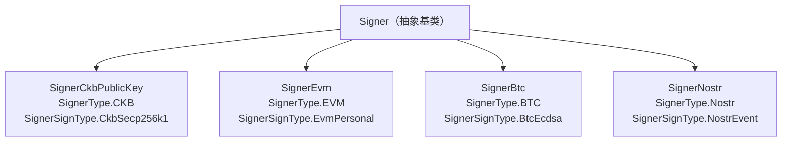

## 什么是 Signer？

`ccc.Signer` 是 CCC 的核心抽象，统一了多个区块链生态的签名方式。同一份应用代码，通过同一套 API，即可对接来自 CKB、EVM、Bitcoin、Nostr、Doge 等生态的钱包——最终统一控制 CKB 资产。

```typescript
// 来自 packages/core/src/signer/signer/index.ts
export abstract class Signer {
  constructor(protected client_: Client) {}

  abstract get type(): SignerType;
  abstract get signType(): SignerSignType;

  get client(): Client {
    return this.client_;
  }
}
```

- `type`——Signer 所属的区块链生态（CKB / EVM / BTC / Nostr / Doge）。
- `signType`——具体的签名方案（CkbSecp256k1、EvmPersonal、BtcEcdsa、NostrEvent、JoyId、DogeEcdsa）。
- `client`——用于与 CKB 节点通信的 `ccc.Client` 实例。

`Signer` 通常**不需要手工构造**。它们由钱包连接器生成（例如 React 连接器中的 `useCcc()` 或 `SignersController`）。在服务端代码中也可以直接实例化（参见 [获取 Signer](#获取-signer)）。

## Signer 继承关系



## Signer 枚举

### `SignerType`

标识 `Signer` 所属的区块链生态。

```typescript
// 来自 packages/core/src/signer/signer/index.ts
export enum SignerType {
  EVM   = "EVM",
  BTC   = "BTC",
  CKB   = "CKB",
  Nostr = "Nostr",
  Doge  = "Doge",
}
```

### `SignerSignType`

标识 `Signer` 使用的具体签名方案。

```typescript
// 来自 packages/core/src/signer/signer/index.ts
export enum SignerSignType {
  Unknown      = "Unknown",
  BtcEcdsa     = "BtcEcdsa",
  EvmPersonal  = "EvmPersonal",
  JoyId        = "JoyId",
  NostrEvent   = "NostrEvent",
  CkbSecp256k1 = "CkbSecp256k1",
  DogeEcdsa    = "DogeEcdsa",
}
```

## 核心方法

### 连接管理

```typescript
// 连接钱包
abstract connect(): Promise<void>;

// 断开钱包连接
async disconnect(): Promise<void>;

// 检查当前是否已连接
abstract isConnected(): Promise<boolean>;
```

### 地址查询

```typescript
// 获取钱包的内部（原生）地址字符串
abstract getInternalAddress(): Promise<string>;

// 获取用于验证签名的身份标识（通常是地址或公钥）
abstract getIdentity(): Promise<string>;

// 获取推荐的 CKB 地址字符串
async getRecommendedAddress(preference?: unknown): Promise<string>;

// 获取所有 CKB 地址字符串
async getAddresses(): Promise<string[]>;

// 获取所有 Address 对象（包含对应的 Script）
abstract getAddressObjs(): Promise<Address[]>;

// 获取推荐的 Address 对象
async getRecommendedAddressObj(_preference?: unknown): Promise<Address>;
```

### 余额查询

```typescript
// 返回所有地址的总余额（单位：Shannon）
async getBalance(): Promise<Num>;
```

### 消息签名

```typescript
// 对消息签名，返回完整的 Signature 对象
async signMessage(message: string | BytesLike): Promise<Signature>;

// 对消息签名，仅返回签名字符串（由子类实现）
abstract signMessageRaw(message: string | BytesLike): Promise<string>;

// 验证消息签名
async verifyMessage(
  message: string | BytesLike,
  signature: string | Signature,
): Promise<boolean>;

// 静态验证器，根据 signature.signType 自动调度算法
static async verifyMessage(
  message: string | BytesLike,
  signature: Signature,
): Promise<boolean>;
```

### 交易处理

```typescript
// 准备交易（添加 cell deps、占位 witness 等）
async prepareTransaction(tx: TransactionLike): Promise<Transaction>;

// 对已准备好的交易签名
async signOnlyTransaction(_: TransactionLike): Promise<Transaction>;

// 准备并签名，一步完成
async signTransaction(tx: TransactionLike): Promise<Transaction>;

// 签名并广播，返回交易哈希
async sendTransaction(tx: TransactionLike): Promise<Hex>;
```

### 链上数据查询

```typescript
// 异步生成器，逐个返回该 Signer 持有的 Cell
async *findCells(
  filter: ClientCollectableSearchKeyFilterLike,
  withData?: boolean | null,
  order?: "asc" | "desc",
  limit?: number,
): AsyncGenerator<Cell>;

// 异步生成器，逐个返回与该 Signer 相关的交易
async *findTransactions(
  filter: ClientCollectableSearchKeyFilterLike,
  groupByTransaction?: boolean | null,
  order?: "asc" | "desc",
  limit?: number,
): AsyncGenerator<...>;
```

## 具体实现

### CKB Signer

#### `SignerCkbPublicKey`

基于 33 字节压缩公钥的只读 Signer，支持发现 AnyoneCanPay 地址。

- `getAddressObjSecp256k1()`——返回 `Secp256k1Blake160` 地址。
- `getAddressObjs()`——返回主地址，外加最多 10 个已发现的 AnyoneCanPay 地址。

#### `SignerCkbPrivateKey`

继承自 `SignerCkbPublicKey`，使用 32 字节私钥实现签名。

签名流程：

1. 计算消息哈希：`hashCkb("Nervos Message:" + message)`。
2. 生成带恢复 ID 的 65 字节 ECDSA 签名。
3. 将签名写入 witness 的 `lock` 字段。

### EVM Signer

允许 Ethereum 系钱包通过 OmniLock 或 PWLock 脚本控制 CKB 资产。

Lock 脚本 `args` 格式：

- OmniLock（新版本，flag `0x12`）：`[0x12, ...evmAddress(20 字节), 0x00]`
- OmniLock（旧版本，flag `0x01`）：`[0x01, ...evmAddress(20 字节), 0x00]`
- PWLock：`evmAddress(20 字节)`，直接映射地址。

签名流程：

- OmniLock：使用 `personal_sign`，消息前缀为 `"CKB transaction: " + txHash`。
- PWLock：使用 Keccak256 而非 Blake2b 计算交易哈希。

### BTC Signer

Bitcoin Signer 使用 OmniLock 的 Bitcoin 认证标志（`0x04`）。

- Args：`[0x04, ...btcEcdsaPublicKeyHash(publicKey), 0x00]`
- `btcEcdsaPublicKeyHash` = `RIPEMD160(SHA256(publicKey))`。

签名流程：

- 消息格式：`"CKB (Bitcoin Layer) transaction: " + txHash`。
- 调用钱包的 `signMessage`（返回 base64），再调整恢复标志。
<Callout type="info">
"调整恢复标志"是指将比特币钱包返回的签名中的恢复标志（recovery flag）从比特币标准格式转换为 CKB OmniLock 需要的格式。
</Callout>

### Nostr Signer

通过 Nostr 事件签名（NIP-01）控制 CKB 资产。

NostrLock 脚本 args：`[0x00, ...hashCkb(pubkey)[0:21]]`。

事件结构：

```json
{
  "pubkey": "nostr_public_key_hex",
  "created_at": 1234567890,
  "kind": 23334,
  "tags": [["ckb_sighash_all", "transaction_hash_hex"]],
  "content": "Signing a CKB transaction...",
  "id": "event_id",
  "sig": "event_signature"
}
```

常量：

- `CKB_UNLOCK_EVENT_KIND` = `23334`
- `CKB_SIG_HASH_ALL_TAG` = `"ckb_sighash_all"`

### JoyID Signer

基于 WebAuthn / passkeys 的 CKB Signer。

子密钥(sub_key)钱包支持：

- 向 JoyID Aggregator 服务查询解锁 SMT 证明。
- 添加 COTA cell dependency。
- 由于 WebAuthn 签名格式的特殊性，witness 占位大小为 1000 字节。

### Lock 脚本生成汇总

| Signer | 输入 | Lock 脚本 | Args 格式 | Witness 大小 |
| --- | --- | --- | --- | --- |
| CKB | 33 字节公钥 | Secp256k1Blake160 | `hashCkb(pubkey)[0:20]` | 65 字节 |
| CKB | （同上） | AnyoneCanPay | `hashCkb(pubkey)[0:20] + ...` | 65 字节 |
| EVM | 20 字节地址 | OmniLock（现代） | `0x12 + address + 0x00` | 85 字节 |
| EVM | （同上） | OmniLock（旧版） | `0x01 + address + 0x00` | 85 字节 |
| EVM | （同上） | PWLock | `address` | 65 字节 |
| BTC | 33/65 字节公钥 | OmniLock | `0x04 + hash160(pubkey) + 0x00` | 85 字节 |
| Nostr | 32 字节公钥 | NostrLock | `0x00 + hashCkb(pubkey)[0:21]` | 572 字节 |
| JoyID | WebAuthn 公钥 | JoyID | `hashCkb(pubkey)[0:20]` | 1000 字节 |

## 钱包集成

### EIP-6963（MetaMask、OKX 等）

```typescript
import { Signer } from "@ckb-ccc/eip6963";

const signer = new Signer(client, provider);
await signer.connect();
const address = await signer.getRecommendedAddress();
```

### NIP-07（Nostr 扩展）

```typescript
import { Signer } from "@ckb-ccc/nip07";

const signer = new Signer(client, window.nostr);
await signer.connect();
```

### JoyID

```typescript
import { getJoyIdSigners } from "@ckb-ccc/joy-id";

const signers = getJoyIdSigners(client, "My App", "icon.png");
```

## 使用示例

### 获取地址与余额

```typescript
import { ccc } from "@ckb-ccc/ccc";

async function printWalletInfo(signer: ccc.Signer) {
  if (!(await signer.isConnected())) {
    await signer.connect();
  }

  const address = await signer.getRecommendedAddress();
  console.log("CKB 地址：", address);

  const allAddresses = await signer.getAddresses();
  console.log("所有地址：", allAddresses);

  const balance = await signer.getBalance();
  console.log("余额（Shannon）：", balance.toString());
}
```

### 签名与验证消息

```typescript
import { ccc } from "@ckb-ccc/ccc";

async function signAndVerify(signer: ccc.Signer, message: string) {
  const sig = await signer.signMessage(message);
  console.log("签名：", sig.signature);
  console.log("签名类型：", sig.signType);

  // 实例方法验证（使用当前 Signer 的算法）
  const valid = await signer.verifyMessage(message, sig);

  // 静态方法验证——根据 sig.signType 自动分发，无需 Signer 实例
  const valid2 = await ccc.Signer.verifyMessage(message, sig);

  console.log("验证结果：", valid, valid2);
}
```

### 获取 `Signer`

实际开发中，`Signer` 通常由钱包连接器提供，而非直接实例化。

<Tabs items={["React 连接器", "Node.js / shell"]}>
  <Tab value="React 连接器">
    ```typescript
    import { useCcc } from "@ckb-ccc/connector-react";

    function MyComponent() {
      const { signer } = useCcc();

      if (!signer) {
        return <p>未连接钱包</p>;
      }

      // signer 即 ccc.Signer 实例
    }
    ```
  </Tab>

  <Tab value="Node.js / shell">
    ```typescript
    import { ccc } from "@ckb-ccc/shell";

    // 服务端可直接构造 Signer
    const signer = new ccc.SignerCkbPrivateKey(client, privateKey);
    await signer.connect();
    ```
  </Tab>
</Tabs>