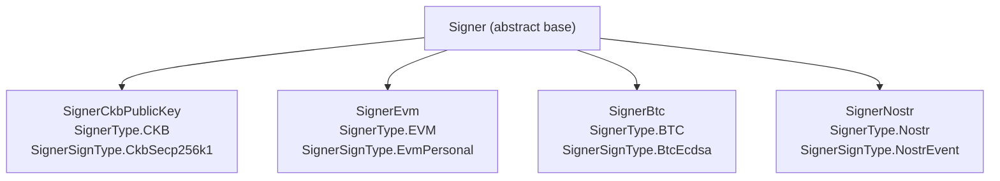

## What is a Signer?

`ccc.Signer` is the core abstraction that unifies signing across multiple blockchain ecosystems. It lets a single piece of CCC application code work with wallets from CKB, EVM, Bitcoin, Nostr, Doge, and more — all through the same API — while ultimately controlling CKB assets.

```typescript
// From packages/core/src/signer/signer/index.ts
export abstract class Signer {
  constructor(protected client_: Client) {}

  abstract get type(): SignerType;
  abstract get signType(): SignerSignType;

  get client(): Client {
    return this.client_;
  }
}
```

- `type` — the originating blockchain ecosystem (CKB / EVM / BTC / Nostr / Doge).
- `signType` — the concrete signing scheme (CkbSecp256k1, EvmPersonal, BtcEcdsa, NostrEvent, JoyId, DogeEcdsa).
- `client` — the `ccc.Client` used to talk to a CKB node.

Signers are normally **not constructed by hand**. They are produced by wallet connectors (e.g. `useCcc()` in the React connector, or `SignersController`). For server-side code you may instantiate one directly (see [Obtaining a signer](#obtaining-a-signer)).

## Signer hierarchy



## Signer enums

### SignerType

Identifies the originating blockchain ecosystem of the signer.

```typescript
// From packages/core/src/signer/signer/index.ts
export enum SignerType {
  EVM   = "EVM",
  BTC   = "BTC",
  CKB   = "CKB",
  Nostr = "Nostr",
  Doge  = "Doge",
}
```

### SignerSignType

Identifies the specific signing scheme used by the signer.

```typescript
// From packages/core/src/signer/signer/index.ts
export enum SignerSignType {
  Unknown      = "Unknown",
  BtcEcdsa     = "BtcEcdsa",
  EvmPersonal  = "EvmPersonal",
  JoyId        = "JoyId",
  NostrEvent   = "NostrEvent",
  CkbSecp256k1 = "CkbSecp256k1",
  DogeEcdsa    = "DogeEcdsa",
}
```

## Key methods

### Connection

```typescript
// Connect to the wallet
abstract connect(): Promise<void>;

// Disconnect from the wallet
async disconnect(): Promise<void>;

// Check whether the signer is currently connected
abstract isConnected(): Promise<boolean>;
```

### Addresses

```typescript
// Get the wallet's internal (native) address string
abstract getInternalAddress(): Promise<string>;

// Get an identity used to verify signatures (typically address or pubkey)
abstract getIdentity(): Promise<string>;

// Get the recommended CKB address as a string
async getRecommendedAddress(preference?: unknown): Promise<string>;

// Get all CKB addresses as strings
async getAddresses(): Promise<string[]>;

// Get all Address objects (includes the associated Script)
abstract getAddressObjs(): Promise<Address[]>;

// Get the recommended Address object
async getRecommendedAddressObj(_preference?: unknown): Promise<Address>;
```

### Balance

```typescript
// Returns total balance (in Shannon) across all addresses
async getBalance(): Promise<Num>;
```

### Signing messages

```typescript
// Sign a message and return a full Signature object
async signMessage(message: string | BytesLike): Promise<Signature>;

// Sign a message and return only the signature string (implemented by subclasses)
abstract signMessageRaw(message: string | BytesLike): Promise<string>;

// Verify a message signature
async verifyMessage(
  message: string | BytesLike,
  signature: string | Signature,
): Promise<boolean>;

// Static verifier — dispatches to the algorithm implied by signature.signType
static async verifyMessage(
  message: string | BytesLike,
  signature: Signature,
): Promise<boolean>;
```

### Transactions

```typescript
// Prepare a transaction (adds cell deps, dummy witnesses, etc.)
async prepareTransaction(tx: TransactionLike): Promise<Transaction>;

// Sign a prepared transaction
async signOnlyTransaction(_: TransactionLike): Promise<Transaction>;

// Prepare + sign in one step
async signTransaction(tx: TransactionLike): Promise<Transaction>;

// Sign and broadcast — returns the transaction hash
async sendTransaction(tx: TransactionLike): Promise<Hex>;
```

### Searching chain data

```typescript
// Async generator yielding cells owned by this signer
async *findCells(
  filter: ClientCollectableSearchKeyFilterLike,
  withData?: boolean | null,
  order?: "asc" | "desc",
  limit?: number,
): AsyncGenerator<Cell>;

// Async generator yielding transactions related to this signer
async *findTransactions(
  filter: ClientCollectableSearchKeyFilterLike,
  groupByTransaction?: boolean | null,
  order?: "asc" | "desc",
  limit?: number,
): AsyncGenerator<...>;
```

## Concrete implementations

### CKB signers

#### `SignerCkbPublicKey`

A read-only signer built from a 33-byte compressed public key. Supports discovery of AnyoneCanPay addresses.

- `getAddressObjSecp256k1()` — returns the `Secp256k1Blake160` address.
- `getAddressObjs()` — returns the primary address plus up to 10 discovered AnyoneCanPay addresses.

#### `SignerCkbPrivateKey`

Extends `SignerCkbPublicKey` and adds signing using a 32-byte private key.

Signing flow:

1. Compute the message hash: `hashCkb("Nervos Message:" + message)`.
2. Produce a 65-byte ECDSA signature with a recovery id.
3. Place the signature in the witness `lock` field.

### EVM signers

Allow Ethereum-style wallets to control CKB assets through OmniLock or PWLock scripts.

Lock script `args` formats:

- OmniLock (modern Ethereum auth flag `0x12`): `[0x12, ...evmAddress(20 bytes), 0x00]`
- OmniLock (legacy Ethereum flag `0x01`): `[0x01, ...evmAddress(20 bytes), 0x00]`
- PWLock: `evmAddress(20 bytes)` — direct address mapping.

Signing flow:

- OmniLock: uses `personal_sign` with message prefix `"CKB transaction: " + txHash`.
- PWLock: uses Keccak256 instead of Blake2b for the transaction hash.

### BTC signers

Bitcoin signers use the OmniLock Bitcoin auth flag (`0x04`).

- Args: `[0x04, ...btcEcdsaPublicKeyHash(publicKey), 0x00]`
- `btcEcdsaPublicKeyHash` = `RIPEMD160(SHA256(publicKey))`.

Signing flow:

- Message format: `"CKB (Bitcoin Layer) transaction: " + txHash`.
- Use the wallet's `signMessage` (returns base64), then adjust the recovery flag.

### Nostr signers

Control CKB assets through Nostr event signatures (NIP-01).

NostrLock script args: `[0x00, ...hashCkb(pubkey)[0:21]]`.

Event structure:

```json
{
  "pubkey": "nostr_public_key_hex",
  "created_at": 1234567890,
  "kind": 23334,
  "tags": [["ckb_sighash_all", "transaction_hash_hex"]],
  "content": "Signing a CKB transaction...",
  "id": "event_id",
  "sig": "event_signature"
}
```

Constants:

- `CKB_UNLOCK_EVENT_KIND` = `23334`
- `CKB_SIG_HASH_ALL_TAG` = `"ckb_sighash_all"`

### JoyID signer

CKB signer backed by WebAuthn / passkeys.

Sub-key wallet support:

- Queries the JoyID Aggregator service for an unlock SMT proof.
- Adds the COTA cell dependency.
- Witness placeholder size is 1000 bytes (due to the WebAuthn signature format).

### Lock script generation summary

| Signer | Input | Lock script | Args format | Witness size |
| --- | --- | --- | --- | --- |
| CKB | 33-byte pubkey | Secp256k1Blake160 | `hashCkb(pubkey)[0:20]` | 65 bytes |
| CKB | (same) | AnyoneCanPay | `hashCkb(pubkey)[0:20] + ...` | 65 bytes |
| EVM | 20-byte address | OmniLock (modern) | `0x12 + address + 0x00` | 85 bytes |
| EVM | (same) | OmniLock (legacy) | `0x01 + address + 0x00` | 85 bytes |
| EVM | (same) | PWLock | `address` | 65 bytes |
| BTC | 33/65-byte pubkey | OmniLock | `0x04 + hash160(pubkey) + 0x00` | 85 bytes |
| Nostr | 32-byte pubkey | NostrLock | `0x00 + hashCkb(pubkey)[0:21]` | 572 bytes |
| JoyID | WebAuthn pubkey | JoyID | `hashCkb(pubkey)[0:20]` | 1000 bytes |


## Wallet integrations

### EIP-6963 (MetaMask, OKX, ...)

```typescript
import { Signer } from "@ckb-ccc/eip6963";

const signer = new Signer(client, provider);
await signer.connect();
const address = await signer.getRecommendedAddress();
```

### NIP-07 (Nostr extensions)

```typescript
import { Signer } from "@ckb-ccc/nip07";

const signer = new Signer(client, window.nostr);
await signer.connect();
```

### JoyID

```typescript
import { getJoyIdSigners } from "@ckb-ccc/joy-id";

const signers = getJoyIdSigners(client, "My App", "icon.png");
```

## Usage examples

### Getting address and balance

```typescript
import { ccc } from "@ckb-ccc/ccc";

async function printWalletInfo(signer: ccc.Signer) {
  if (!(await signer.isConnected())) {
    await signer.connect();
  }

  const address = await signer.getRecommendedAddress();
  console.log("CKB address:", address);

  const allAddresses = await signer.getAddresses();
  console.log("All addresses:", allAddresses);

  const balance = await signer.getBalance();
  console.log("Balance (Shannon):", balance.toString());
}
```

### Signing a message

```typescript
import { ccc } from "@ckb-ccc/ccc";

async function signAndVerify(signer: ccc.Signer, message: string) {
  const sig = await signer.signMessage(message);
  console.log("Signature:", sig.signature);
  console.log("Sign type:", sig.signType);

  // Instance verify (uses this signer's algorithm)
  const valid = await signer.verifyMessage(message, sig);

  // Or static verify — dispatches by sig.signType, no signer instance needed
  const valid2 = await ccc.Signer.verifyMessage(message, sig);

  console.log("Valid:", valid, valid2);
}
```

### Obtaining a signer

In practice, signers are provided by wallet connectors rather than instantiated directly.

<Tabs items={["React connector", "Node.js / shell"]}>
  <Tab value="React connector">
    ```typescript
    import { useCcc } from "@ckb-ccc/connector-react";

    function MyComponent() {
      const { signer } = useCcc();

      if (!signer) {
        return <p>No wallet connected</p>;
      }

      // signer is a ccc.Signer
    }
    ```
  </Tab>

  <Tab value="Node.js / shell">
    ```typescript
    import { ccc } from "@ckb-ccc/shell";

    // For server-side usage, construct a signer directly
    const signer = new ccc.SignerCkbPrivateKey(client, privateKey);
    await signer.connect();
    ```
  </Tab>
</Tabs>