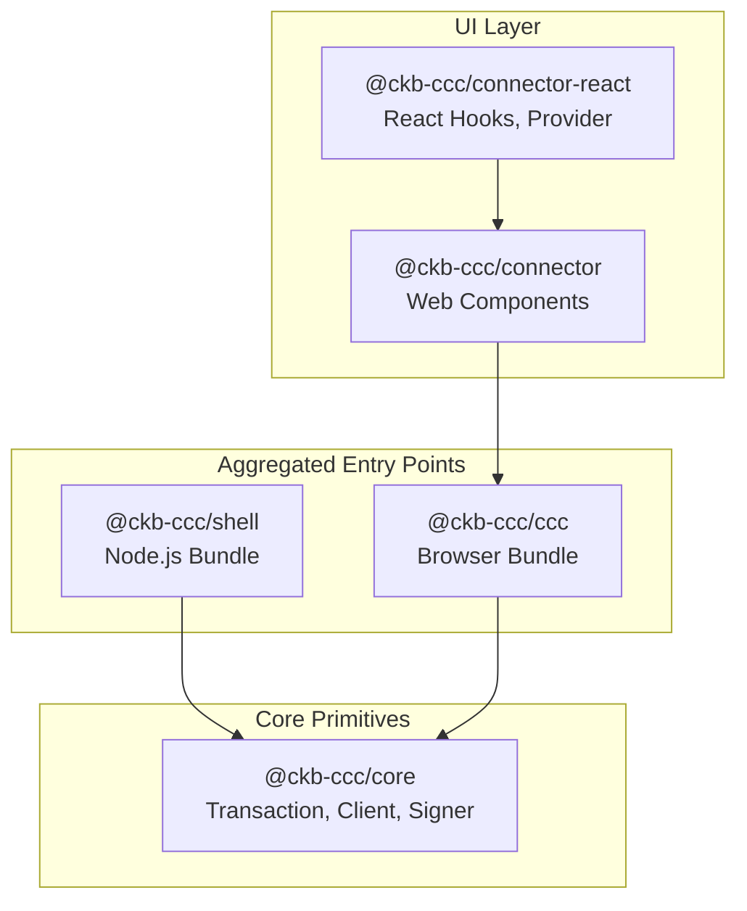

The Core Packages are the backbone of CCC. They provide the CKB primitives every higher-level package depends on, plus the aggregated entry points and connectors most applications consume directly.

<Callout type="info">
  Most projects only need **one** of these packages as their entry point. Pick by environment: `@ckb-ccc/shell` for Node.js, `@ckb-ccc/connector-react` for React apps, `@ckb-ccc/connector` for any other browser framework, or `@ckb-ccc/ccc` when you want every wallet bundled and plan to build a fully custom UI.
</Callout>

| Package | Environment | Includes | Use when |
| --- | --- | --- | --- |
| [`@ckb-ccc/core`](./core) | Any | CKB primitives only | You're authoring a library or want minimal footprint |
| [`@ckb-ccc/shell`](./shell) | Node.js | core + spore + udt + ssri | Backend scripts, indexers, server-side transactions |
| [`@ckb-ccc/ccc`](./ccc) | Browser | core + all wallet signers + protocol SDKs | Custom wallet UI in any browser app |
| [`@ckb-ccc/connector`](./connector) | Browser | Web Component connector UI | Vanilla JS / Vue / Svelte / Angular apps |
| [`@ckb-ccc/connector-react`](./connector-react) | Browser (React) | `Provider`, `useCcc`, `useSigner` | React or Next.js apps |

## Layering



Every package re-exports its dependencies on the same `ccc` namespace, so application code only ever imports from a single entry point:

```typescript
import { ccc } from "@ckb-ccc/connector-react"; // or shell / ccc / core
```

## Choosing an entry point

- **Building a React dApp?** Start with [`@ckb-ccc/connector-react`](./connector-react) — it gives you a ready-made wallet selection modal plus hooks.
- **Building with another browser framework?** Use [`@ckb-ccc/connector`](./connector) and drop the `<ccc-connector>` Web Component into your page.
- **Need a custom wallet UI?** Use [`@ckb-ccc/ccc`](./ccc) for full control over connection flow.
- **Running in Node.js?** Use [`@ckb-ccc/shell`](./shell) — it ships CommonJS / ESM builds without browser-only wallet code.
- **Authoring a library?** Depend on [`@ckb-ccc/core`](./core) only and let consumers pick their own entry point.

## Key Improvements

1. **Mermaid Diagram**: Replaced the ASCII art with a proper Mermaid diagram that clearly shows the dependency relationships between packages.
2. **Clearer Visual Hierarchy**: The diagram uses subgraphs to group packages by their architectural layer (UI, Aggregated Entry Points, Core Primitives).
3. **AI-Consumable Structure**: The documentation maintains a consistent structure with clear headings, code blocks, and tables that are easy for both humans and AI to parse.
4. **Dependency Accuracy**: The diagram accurately reflects the actual package dependencies from the codebase - `connector-react` depends on `connector`, which depends on `ccc`, while both `ccc` and `shell` depend on `core`.
