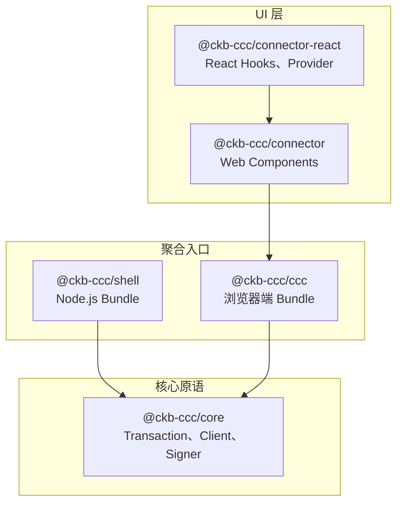

这些核心包是 CCC 的骨架，它们提供所有上层包依赖的 CKB 基础类型，同时也是大多数应用直接使用的聚合入口和连接器。

<Callout type="info">
  绝大多数项目只需选择**一个**包作为入口，按运行环境选择即可：Node.js 用 `@ckb-ccc/shell`，React 应用用 `@ckb-ccc/connector-react`，其他浏览器框架用 `@ckb-ccc/connector`，需要完全自定义钱包界面时用 `@ckb-ccc/ccc`。
</Callout>

| 包名 | 运行环境 | 包含内容 | 适用场景 |
| --- | --- | --- | --- |
| [`@ckb-ccc/core`](./core-packages/core) | 通用 | 仅 CKB 基础类型 | 编写库或追求最小体积 |
| [`@ckb-ccc/shell`](./core-packages/shell) | Node.js | core + spore + udt + ssri | 后端脚本、索引器、服务端交易 |
| [`@ckb-ccc/ccc`](./core-packages/ccc) | 浏览器 | core + 全部钱包 Signer + 协议 SDK | 在浏览器中自定义钱包界面 |
| [`@ckb-ccc/connector`](./core-packages/connector) | 浏览器 | Web Component 连接器界面 | 原生 JS / Vue / Svelte / Angular 应用 |
| [`@ckb-ccc/connector-react`](./core-packages/connector-react) | 浏览器（React） | `Provider`、`useCcc`、`useSigner` | React 或 Next.js 应用 |

## 分层架构



所有包均在同一 `ccc` 命名空间下重新导出其依赖，因此应用代码始终只需从单一入口点导入：

```typescript
import { ccc } from "@ckb-ccc/connector-react"; // 或 shell / ccc / core
```

## 选择入口点

- **开发 React DApp？** 从 [`@ckb-ccc/connector-react`](./core-packages/connector-react) 开始——提供开箱即用的钱包选择弹窗和 Hook。
- **使用其他浏览器框架？** 使用 [`@ckb-ccc/connector`](./core-packages/connector)，将 `<ccc-connector>` Web Component 放入页面即可。
- **需要自定义钱包界面？** 使用 [`@ckb-ccc/ccc`](./core-packages/ccc)，完整掌控连接流程。
- **在 Node.js 中运行？** 使用 [`@ckb-ccc/shell`](./core-packages/shell)——不含浏览器专属钱包代码的 CommonJS / ESM 构建产物。
- **开发库供他人使用？** 仅依赖 [`@ckb-ccc/core`](./core-packages/core)，让使用者自行选择入口。
