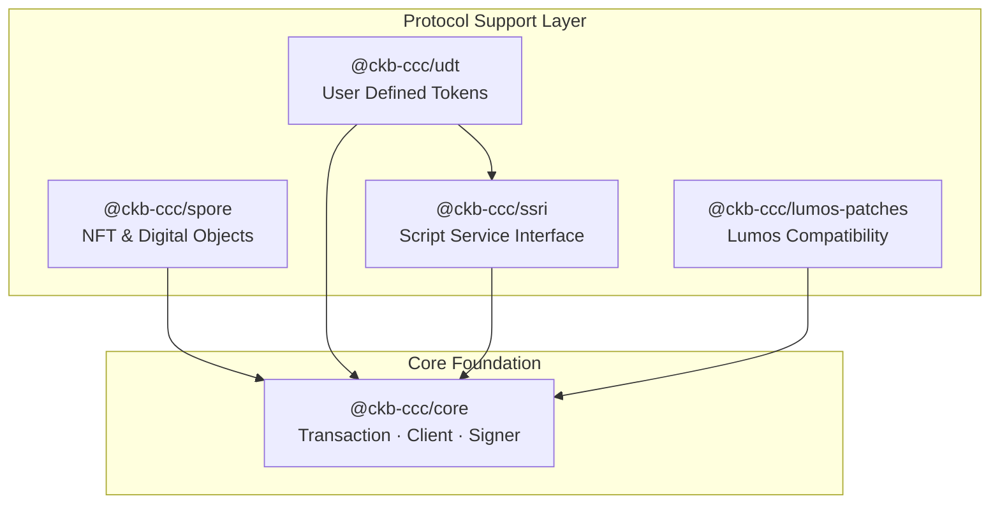

The Protocol Support Layer adds higher-level abstractions over `@ckb-ccc/core` for the CKB ecosystem's most-used protocols. Each SDK composes transactions through the same declarative pattern as core, so you can mix them freely with your own custom logic.

<Callout type="info">
  `@ckb-ccc/spore`, `@ckb-ccc/udt`, and `@ckb-ccc/ssri` are already bundled in `@ckb-ccc/shell` and `@ckb-ccc/ccc`. You only need to install them individually if you depend on `@ckb-ccc/core` directly.
</Callout>

## Architecture



## Package Overview

| Package | Purpose | Built on | Use when |
| --- | --- | --- | --- |
| [`@ckb-ccc/spore`](./spore) | Create, transfer, and melt on-chain Digital Objects (DOBs) and Clusters | core | Building NFT-like assets or on-chain media |
| [`@ckb-ccc/udt`](./udt) | Issue, mint, and transfer User Defined Tokens (xUDT / sUDT) | core + ssri | Issuing or moving fungible tokens |
| [`@ckb-ccc/ssri`](./ssri) | Call named methods on SSRI-compliant CKB scripts | core | Calling custom CKB scripts with SSRI methods |
| [`@ckb-ccc/lumos-patches`](./lumos-patches) | Add JoyID / Nostr / Portal lock support to legacy Lumos apps | Lumos SDK | Migrating a Lumos app gradually |

## Quick Start

All protocol SDKs follow the core declarative pattern — describe the desired outputs, then let CCC complete inputs, fees, and change:

```typescript
import { ccc } from "@ckb-ccc/shell";

// Example: transfer xUDT
const udt = new ccc.udt.Udt(udtCodeOutPoint, udtType);
const { res: tx } = await udt.transfer(signer, [
  { to: receiverLock, amount: 1000n },
]);

await tx.completeInputsByUdt(signer, udtType);
await tx.completeFeeBy(signer);
const txHash = await signer.sendTransaction(tx);
```

The same pattern applies to Spore creation, SSRI method calls, and any custom transaction you compose alongside them.

## Notes

The Protocol Support Layer packages are designed to work seamlessly with the core declarative transaction pattern. The `@ckb-ccc/udt` package depends on both `@ckb-ccc/core` and `@ckb-ccc/ssri`, while `@ckb-ccc/ssri` and `@ckb-ccc/spore` depend only on `@ckb-ccc/core`. The `@ckb-ccc/shell` package aggregates all protocol implementations for Node.js environments.
