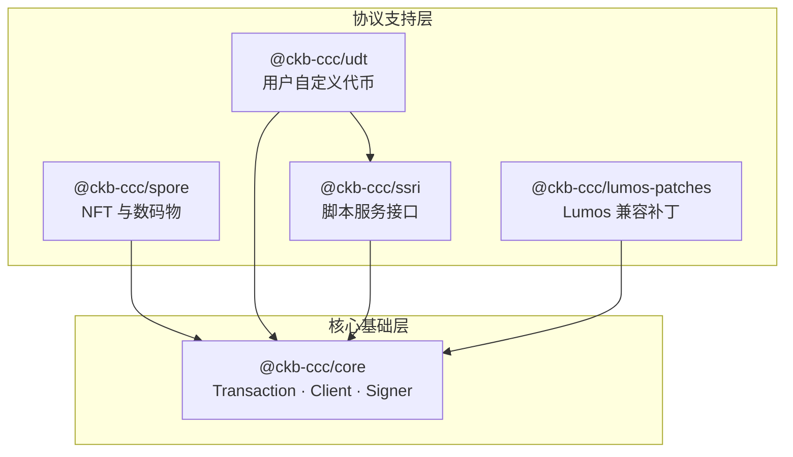

协议支持层在 `@ckb-ccc/core` 基础上，为 CKB 生态最常用的协议提供更高层级的抽象。每个 SDK 均采用与 core 相同的声明式模式构造交易，可与自定义逻辑自由组合。

<Callout type="info">
  `@ckb-ccc/spore`、`@ckb-ccc/udt` 和 `@ckb-ccc/ssri` 已内置于 `@ckb-ccc/shell` 和 `@ckb-ccc/ccc` 中。只有直接依赖 `@ckb-ccc/core` 时，才需要单独安装它们。
</Callout>

## 架构



## 包概览

| 包 | 用途 | 依赖 | 适用场景 |
| --- | --- | --- | --- |
| [`@ckb-ccc/spore`](./spore) | 创建、转移和销毁链上数码物（Digital Object，简称 DOB）及 Cluster | core | 构建类 NFT 资产或链上媒体内容 |
| [`@ckb-ccc/udt`](./udt) | 发行、铸造和转移用户自定义代币（xUDT / sUDT） | core + ssri | 发行或流转同质化代币 |
| [`@ckb-ccc/ssri`](./ssri) | 调用兼容 SSRI 的 CKB 脚本上的具名方法 | core | 通过 SSRI 方法调用自定义 CKB 脚本 |
| [`@ckb-ccc/lumos-patches`](./lumos-patches) | 为旧有 Lumos 应用添加 JoyID / Nostr / Portal Lock 支持 | Lumos SDK | 逐步迁移 Lumos 应用 |

## 快速上手

所有协议 SDK 均遵循 CCC 的声明式交易构建模式——描述期望的输出，然后让 CCC 自动完成输入、手续费和找零：

```typescript
import { ccc } from "@ckb-ccc/shell";

// 示例：转移 xUDT
const udt = new ccc.udt.Udt(udtCodeOutPoint, udtType);
const { res: tx } = await udt.transfer(signer, [
  { to: receiverLock, amount: 1000n },
]);

await tx.completeInputsByUdt(signer, udtType);
await tx.completeFeeBy(signer);
const txHash = await signer.sendTransaction(tx);
```

上述模式同样适用于创建 Spore、调用 SSRI 方法，以及与之组合的任意自定义交易。