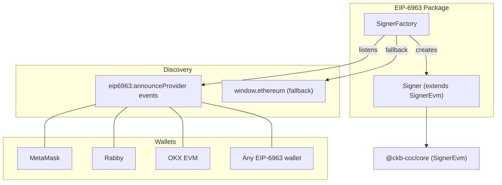
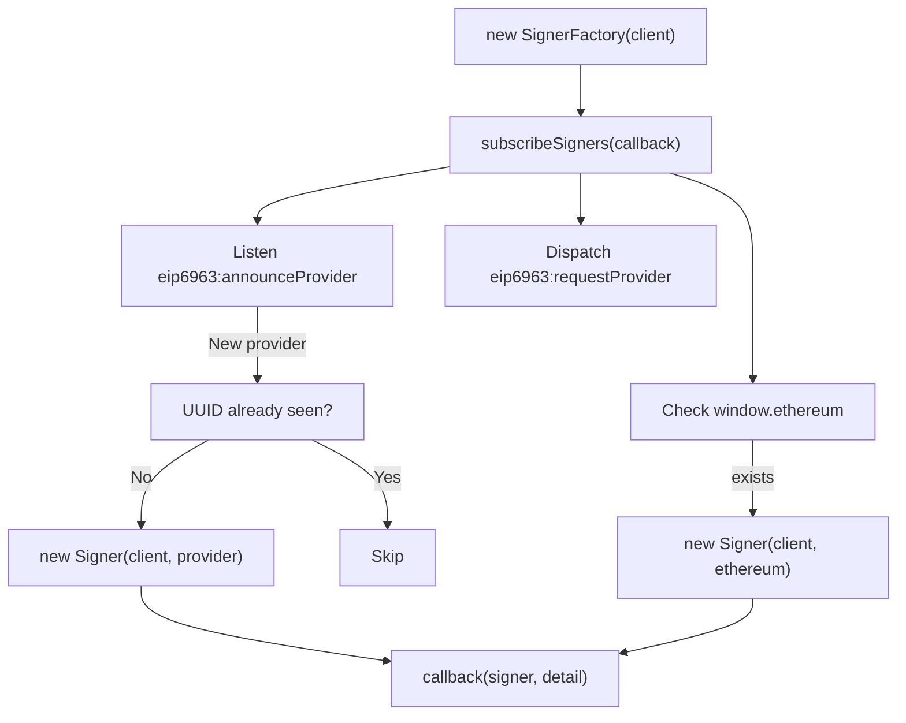
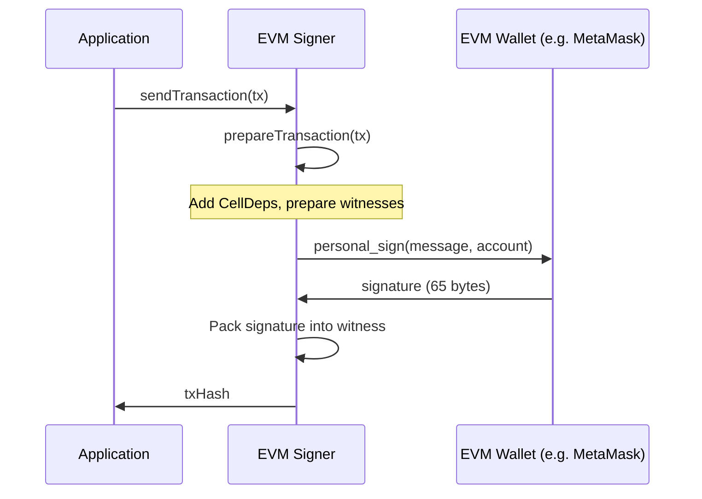

import { PackageBadges } from '@/components/package-badges';

`@ckb-ccc/eip6963` exposes any [EIP-6963](https://eips.ethereum.org/EIPS/eip-6963) compatible browser wallet (MetaMask, Rabby, OKX EVM, etc.) as a CCC `Signer`. It signs CKB transactions via `personal_sign` EVM signatures and derives CKB addresses from the user's Ethereum account.

<Callout type="info">
  If you're using `@ckb-ccc/connector-react` or `@ckb-ccc/ccc`, EIP-6963 wallets are already included — no separate installation needed.
</Callout>

## Installation

<PackageBadges pkg="@ckb-ccc/eip6963" />

<Tabs items={['npm', 'yarn', 'pnpm']}>
  <Tab value="npm">
    ```bash
    npm install @ckb-ccc/eip6963
    ```
  </Tab>
  <Tab value="yarn">
    ```bash
    yarn add @ckb-ccc/eip6963
    ```
  </Tab>
  <Tab value="pnpm">
    ```bash
    pnpm add @ckb-ccc/eip6963
    ```
  </Tab>
</Tabs>

**Dependencies:**

| Package | Description |
| ------- | ----------- |
| `@ckb-ccc/core` | Base types — `Signer`, `Client`, `Transaction`, and more |

## Architecture

Unlike other wallet packages that detect a single global provider, `@ckb-ccc/eip6963` uses the EIP-6963 **multi-injected provider discovery** standard. This means it can discover and create signers for *all* EVM wallets installed in the browser simultaneously.



### Entry point: `SignerFactory`

`SignerFactory` is the main entry point. It listens for `eip6963:announceProvider` events and creates a `Signer` for each unique wallet discovered:



## The `Signer` class

`Signer` extends `ccc.SignerEvm` and adapts any EIP-1193 compatible provider to CKB signing.

### Key methods

| Method | Description |
| ------ | ----------- |
| `connect()` | Calls `eth_requestAccounts` to prompt wallet connection |
| `isConnected()` | Checks if `eth_accounts` returns any account |
| `getEvmAccount()` | Returns the first EVM address from the provider |
| `signMessageRaw(message)` | Signs via `personal_sign` — used for CKB witness generation |
| `onReplaced(listener)` | Fires on `accountsChanged` or `disconnect` events |

### Signing flow

CKB transactions are signed by deriving a CKB address from the EVM account and using `personal_sign` to produce a witness signature:



## Account change detection

`Signer` implements `onReplaced()` to handle account or wallet disconnection:

- Listens for `"accountsChanged"` — user switched account in wallet
- Listens for `"disconnect"` — wallet disconnected

When either fires, the application callback is invoked and the listener is automatically cleaned up.

## Provider interface (EIP-1193)

The package uses a minimal subset of the EIP-1193 provider interface:

| Method | Purpose |
| ------ | ------- |
| `eth_requestAccounts` | Prompt user to connect |
| `eth_accounts` | Get connected accounts (no prompt) |
| `personal_sign` | Sign a message with the selected account |

## Integration pattern

`@ckb-ccc/eip6963` follows the same integration contract as other wallet packages in CCC:

- **Factory class** — `SignerFactory` discovers wallets and creates signers dynamically.
- **Provider detection** — uses EIP-6963 events with `window.ethereum` fallback.
- **Deduplication** — tracks provider UUIDs to avoid duplicate signers.
- **Graceful degradation** — if no EVM wallets are installed, no signers are created.

This means `SignersController` can dynamically discover all EVM wallets without any configuration.
