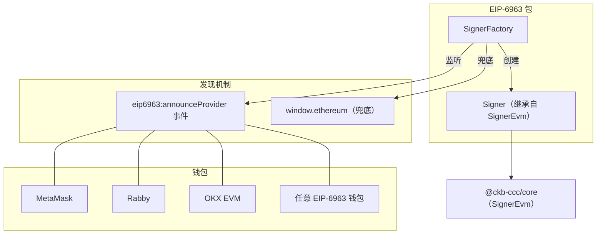
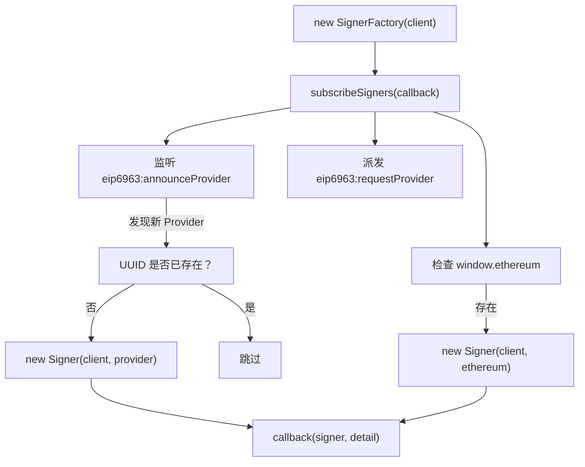
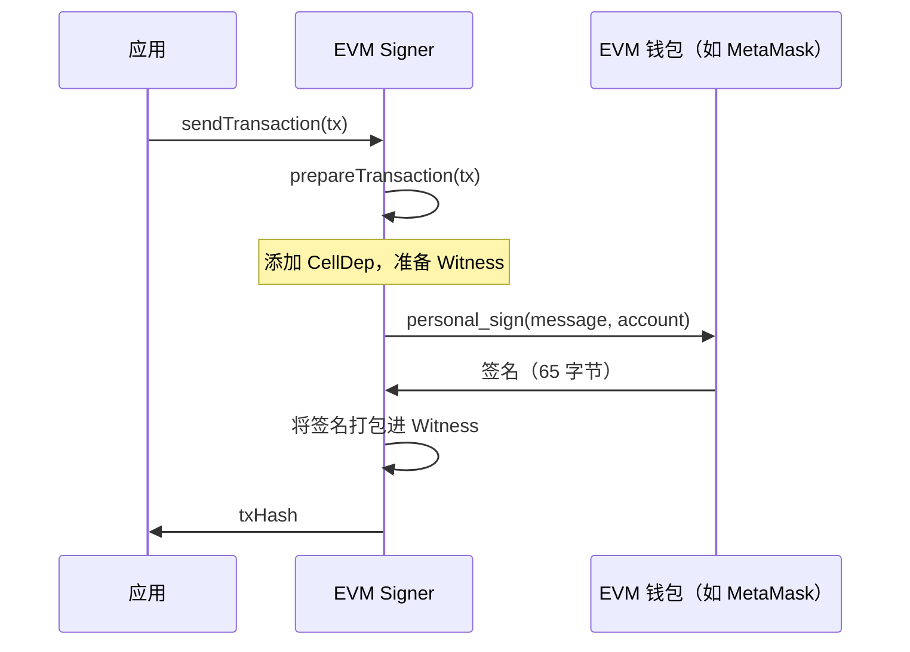

import { PackageBadges } from '@/components/package-badges';

`@ckb-ccc/eip6963` 将任意兼容 [EIP-6963](https://eips.ethereum.org/EIPS/eip-6963) 的浏览器钱包（MetaMask、Rabby、OKX EVM 等）封装为 CCC `Signer`。它通过 EVM 的 `personal_sign` 签名接口对 CKB 交易进行签名，并从用户的 Ethereum 账户派生 CKB 地址。

<Callout type="info">
  如果你使用的是 `@ckb-ccc/connector-react` 或 `@ckb-ccc/ccc`，EIP-6963 钱包已内置其中，无需单独安装。
</Callout>

## 安装

<PackageBadges pkg="@ckb-ccc/eip6963" />

<Tabs items={['npm', 'yarn', 'pnpm']}>
  <Tab value="npm">
    ```bash
    npm install @ckb-ccc/eip6963
    ```
  </Tab>
  <Tab value="yarn">
    ```bash
    yarn add @ckb-ccc/eip6963
    ```
  </Tab>
  <Tab value="pnpm">
    ```bash
    pnpm add @ckb-ccc/eip6963
    ```
  </Tab>
</Tabs>

**依赖：**

| 包 | 说明 |
| ------- | ----------- |
| `@ckb-ccc/core` | 基础类型——`Signer`、`Client`、`Transaction` 等 |

## 架构

与其他只检测单一全局 Provider 的钱包包不同，`@ckb-ccc/eip6963` 采用 EIP-6963 的**多注入 Provider 发现**标准，可同时发现浏览器中安装的*所有* EVM 钱包并为其创建 Signer。



### 入口：`SignerFactory`

`SignerFactory` 是主入口，监听 `eip6963:announceProvider` 事件，为每个发现的唯一钱包创建一个 `Signer`：



## `Signer` 类

`Signer` 继承自 `ccc.SignerEvm`，将任意兼容 EIP-1193 的 Provider 适配为 CKB 签名接口。

### 核心方法

| 方法 | 说明 |
| ------ | ----------- |
| `connect()` | 调用 `eth_requestAccounts`，触发钱包连接提示 |
| `isConnected()` | 检查 `eth_accounts` 是否返回账户 |
| `getEvmAccount()` | 返回 Provider 中的第一个 EVM 地址 |
| `signMessageRaw(message)` | 通过 `personal_sign` 签名——用于生成 CKB Witness |
| `onReplaced(listener)` | 在 `accountsChanged` 或 `disconnect` 事件触发时调用 |

### 签名流程

CKB 交易通过以下方式完成签名：从 EVM 账户派生 CKB 地址，再使用 `personal_sign` 生成 Witness 签名。



## 账户变更检测

`Signer` 通过 `onReplaced()` 处理账户切换或钱包断开连接：

- 监听 `"accountsChanged"`——用户在钱包中切换了账户
- 监听 `"disconnect"`——钱包已断开连接

任一事件触发时，应用回调会被调用，监听器随即自动清理。

## Provider 接口（EIP-1193）

本包使用 EIP-1193 Provider 接口的最小子集：

| 方法 | 用途 |
| ------ | ------- |
| `eth_requestAccounts` | 提示用户连接钱包 |
| `eth_accounts` | 获取已连接账户（不触发提示） |
| `personal_sign` | 使用选定账户签名消息 |

## 集成模式

`@ckb-ccc/eip6963` 遵循 CCC 中其他钱包包相同的集成约定：

- **Factory 类**——`SignerFactory` 动态发现钱包并创建 Signer。
- **Provider 检测**——基于 EIP-6963 事件，以 `window.ethereum` 兜底。
- **去重机制**——追踪 Provider UUID，避免生成重复 Signer。
- **优雅降级**——若未安装任何 EVM 钱包，则不创建任何 Signer。

因此，无需任何配置，`SignersController` 即可动态发现所有 EVM 钱包。