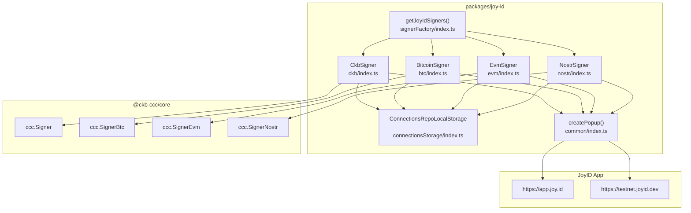
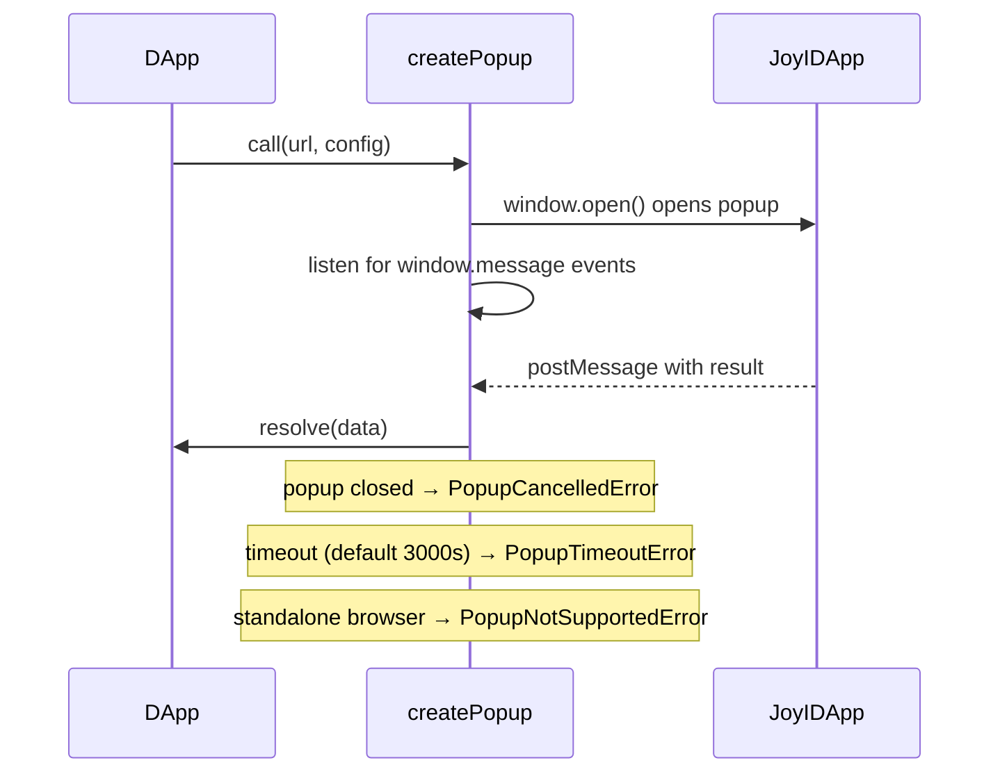

import { PackageBadges } from '@/components/package-badges';

`@ckb-ccc/joy-id` is the Protocol Support Layer package in the CCC responsible for integrating the JoyID wallet. JoyID is a wallet based on WebAuthn/Passkey — no seed phrases required, keys are managed via device biometrics (fingerprint, Face ID, etc.). This package communicates with the JoyID application via browser popups and provides unified `Signer` interface implementations for four chain types: CKB, Bitcoin, EVM, and Nostr. 

## Installation

<PackageBadges pkg="@ckb-ccc/joy-id" />

<Tabs items={['npm', 'yarn', 'pnpm']}>
  <Tab value="npm">
```bash theme={null}
npm install @ckb-ccc/joy-id
```
  </Tab>
  <Tab value="yarn">
```bash theme={null}
yarn add @ckb-ccc/joy-id
```
  </Tab>
  <Tab value="pnpm">
```bash theme={null}
pnpm add @ckb-ccc/joy-id
```
  </Tab>
</Tabs>

**Dependencies:**
| Package | Description |
|---------|-------------|
| `@ckb-ccc/core` | CCC core layer — provides `Signer`, `Client`, `Transaction`, and other base types |
| `@joyid/ckb` | JoyID CKB SDK — provides `Aggregator` (COTA aggregator) |
| `@joyid/common` | JoyID common utilities — provides `buildJoyIDURL`, `createBlockDialog`, `DappRequestType`, etc. | 

<Callout type="info">
  If you are using `@ckb-ccc/connector-react` or `@ckb-ccc/ccc`, JoyID is already included — no separate installation needed.
</Callout>

## Architecture Overview



## Public API Summary

All public exports come from `src/barrel.ts`: 

| Export | Source File | Kind |
|--------|-------------|------|
| `CkbSigner` | `ckb/index.ts` | class |
| `BitcoinSigner` | `btc/index.ts` | class |
| `EvmSigner` | `evm/index.ts` | class |
| `NostrSigner` | `nostr/index.ts` | class |
| `getJoyIdSigners` | `signerFactory/index.ts` | function |

## Core Classes

### 1. `CkbSigner`

Native CKB chain signer based on JoyID Passkey technology. Supports both main key (`main_key`) and sub key (`sub_key`, which depends on the COTA protocol).

**Constructor Parameters:**

```typescript
new CkbSigner(
  client: ccc.Client,          // CKB node client
  name: string,                // DApp name (shown in JoyID popup)
  icon: string,                // DApp icon URL
  _appUri?: string,            // Custom JoyID App URL (optional, auto-selected by network)
  _aggregatorUri?: string,     // Custom COTA aggregator URL (optional)
  connectionsRepo?: ConnectionsRepo  // Connection storage (defaults to localStorage)
)
```

**Properties:**

| Property | Value |
|----------|-------|
| `type` | `ccc.SignerType.CKB` |
| `signType` | `ccc.SignerSignType.JoyId` | 

**Default Endpoints:**

| Network | JoyID App URL | COTA Aggregator URL |
|---------|--------------|---------------------|
| Mainnet (`ckb`) | `https://app.joy.id` | `https://cota.nervina.dev/mainnet-aggregator` |
| Testnet (`ckt`) | `https://testnet.joyid.dev` | `https://cota.nervina.dev/aggregator` | 

**Key Methods:**

- `connect()` — Opens a JoyID popup for authentication (`/auth`), retrieves address, public key, and keyType, then persists to localStorage.
- `disconnect()` — Clears in-memory connection state and removes from localStorage.
- `isConnected()` — Checks in-memory connection; if absent, attempts to restore from localStorage.
- `getInternalAddress()` — Returns the JoyID CKB address string.
- `getIdentity()` — Returns a JSON string `{ address, keyType, publicKey }` used for signature verification.
- `prepareTransaction(txLike)` — Adds JoyId script cell deps; for `sub_key` accounts, additionally adds COTA cell deps and SMT unlock data.
- `signOnlyTransaction(txLike)` — Opens a JoyID popup (`/sign-ckb-raw-tx`) to complete transaction signing.
- `signMessageRaw(message)` — Opens a JoyID popup (`/sign-message`) to sign a message; returns a JSON string `{ signature, alg, message }`. 

**Sub Key Mechanism:**

When `keyType === "sub_key"`, `prepareTransaction` will:
1. Call `generateSubkeyUnlockSmt` on the COTA aggregator to generate an SMT unlock entry.
2. Write the unlock data into the witness `outputType` field.
3. Prepend COTA cell deps to the transaction. 

### 2. `BitcoinSigner`

Bitcoin chain signer supporting both P2WPKH (Native SegWit) and P2TR (Taproot) address types. 

**Constructor Parameters:**

```typescript
new BitcoinSigner(
  client: ccc.Client,
  name: string,
  icon: string,
  preferredNetworks?: ccc.NetworkPreference[],  // defaults to btc/btcTestnet
  addressType?: "auto" | "p2wpkh" | "p2tr",     // defaults to "auto"
  _appUri?: string,
  connectionsRepo?: ConnectionsRepo
)
```

**`addressType` Behavior:**

| Value | Behavior |
|-------|----------|
| `"auto"` | Automatically selects based on the user's JoyID account `btcAddressType` |
| `"p2wpkh"` | Forces Native SegWit address |
| `"p2tr"` | Forces Taproot address | 

**Key Methods:**

- `connect()` — Popup authentication; selects `nativeSegwit` or `taproot` from the response based on `addressType`.
- `getBtcAccount()` — Returns the Bitcoin address string.
- `getBtcPublicKey()` — Returns the Bitcoin public key (`ccc.Hex`).
- `signMessageRaw(message)` — Signs a message using ECDSA (`signMessageType: "ecdsa"`). 

### 3. `EvmSigner`

EVM chain signer that retrieves an Ethereum address and signs via JoyID. 

**Constructor Parameters:**

```typescript
new EvmSigner(
  client: ccc.Client,
  name: string,
  icon: string,
  _appUri?: string,
  connectionsRepo?: ConnectionsRepo
)
```

**Key Methods:**

- `connect()` — Popup authentication; takes `ethAddress` from the response as the EVM account address.
- `getEvmAccount()` — Returns the Ethereum address (`ccc.Hex`).
- `signMessageRaw(message)` — Signs a message; returns a `ccc.Hex` signature. 

### 4. `NostrSigner`

Nostr protocol signer that retrieves a Nostr public key and signs events via JoyID. 

**Constructor Parameters:**

```typescript
new NostrSigner(
  client: ccc.Client,
  name: string,
  icon: string,
  _appUri?: string,
  connectionsRepo?: ConnectionsRepo
)
```

**Key Methods:**

- `connect()` — Popup authentication; takes `nostrPubkey` from the response.
- `getNostrPublicKey()` — Returns the Nostr public key (`ccc.Hex`).
- `signNostrEvent(event)` — Opens a popup (`/sign-nostr-event`) to sign a Nostr event; returns a complete `Required<ccc.NostrEvent>`.

### 5. `getJoyIdSigners()` Factory Function

The recommended integration entry point — returns all JoyID-supported signers in a single call.

**Signature:**

```typescript
function getJoyIdSigners(
  client: ccc.Client,
  name: string,
  icon: string,
  preferredNetworks?: ccc.NetworkPreference[],
): ccc.SignerInfo[]
```

**Returned Signers (standard browser environment):**

| name | Signer Type |
|------|------------|
| `"CKB"` | `CkbSigner` |
| `"BTC"` | `BitcoinSigner` (auto) |
| `"Nostr"` | `NostrSigner` |
| `"EVM"` | `EvmSigner` |
| `"BTC (P2WPKH)"` | `BitcoinSigner` (p2wpkh) |
| `"BTC (P2TR)"` | `BitcoinSigner` (p2tr) |

**WebView / Standalone Browser Fallback:**

In WebView or PWA standalone mode, JoyID cannot open popups. The factory returns `ccc.SignerAlwaysError` instances for CKB, EVM, and BTC — any method call will throw `"JoyID can only be used with standard browsers"`.

## Connection Storage

### `ConnectionsRepo` Interface

### `ConnectionsRepoLocalStorage` (Default Implementation)

Stores connection information as a JSON array under the `"ccc-joy-id-signer"` key in `localStorage`. 

**`Connection` Type:**

```typescript
type Connection = {
  readonly address: string;    // Chain address
  readonly publicKey: ccc.Hex; // Public key (hex format)
  readonly keyType: string;    // "main_key" | "sub_key"
};
```

**`AccountSelector` Type:**

```typescript
type AccountSelector = {
  uri: string;         // JoyID App URL
  addressType: string; // "ckb" | "btc-auto" | "btc-p2wpkh" | "btc-p2tr" | "ethereum" | "nostr"
};
```

**Custom Storage:** Implement the `ConnectionsRepo` interface to replace the default localStorage backend — e.g., with IndexedDB or a server-side store.

## Popup Communication Mechanism

`createPopup()` is the underlying function used by all signers to communicate with the JoyID App. 

**Flow:**



**Error Types:**

| Error Class | Trigger Condition |
|-------------|------------------|
| `PopupNotSupportedError` | Standalone browser does not support popups |
| `PopupCancelledError` | User manually closes the popup |
| `PopupTimeoutError` | Operation times out (default 3000 seconds) |


## Integration with `@ckb-ccc/ccc`

In `@ckb-ccc/ccc`'s `SignersController`, JoyID is registered under the name `"JoyID Passkey"`: 

When using `@ckb-ccc/connector-react`, JoyID automatically appears in the wallet selection UI — no manual integration required.


## Usage Examples

### Example 0: Using `@ckb-ccc/connector-react`(Recommended)

JoyID is automatically registered when using the CCC connector:

```tsx theme={null}
import { ccc } from "@ckb-ccc/connector-react";

export default function App({ children }) {
  return (
    <ccc.Provider name="My App" icon="/icon.png">
      {children}
    </ccc.Provider>
  );
}
```

When the user opens the wallet selector, JoyID appears as an option. No additional configuration is required.

### Example 1: Factory Function Integration 

```typescript
import { ccc } from "@ckb-ccc/core";
import { getJoyIdSigners } from "@ckb-ccc/joy-id";

const client = new ccc.ClientPublicTestnet();

const signers = getJoyIdSigners(
  client,
  "My DApp",
  "https://my-dapp.com/icon.png",
);

// Find the CKB signer
const ckbSignerInfo = signers.find((s) => s.name === "CKB");
const signer = ckbSignerInfo!.signer;

await signer.connect();
const address = await signer.getRecommendedAddress();
console.log("CKB Address:", address);
```

### Example 2: Direct `CkbSigner` Usage

```typescript
import { ccc } from "@ckb-ccc/core";
import { CkbSigner } from "@ckb-ccc/joy-id";

const client = new ccc.ClientPublicMainnet();
const signer = new CkbSigner(client, "My DApp", "https://my-dapp.com/icon.png");

await signer.connect();

// Build and send transaction
const tx = ccc.Transaction.from({
  outputs: [{ lock: await signer.getAddressObj().then((a) => a.script), capacity: ccc.fixedPointFrom(100) }],
  outputsData: ["0x"],
});
await tx.completeInputsByCapacity(signer);
await tx.completeFeeBy(signer, 1000);
const txHash = await signer.sendTransaction(tx);
console.log("TxHash:", txHash);
```

### Example 3: Custom COTA Aggregator (for sub_key accounts)

```typescript
import { CkbSigner } from "@ckb-ccc/joy-id";

const signer = new CkbSigner(
  client,
  "My DApp",
  "https://my-dapp.com/icon.png",
  undefined,                                    // use default JoyID App URL
  "https://my-custom-aggregator.com/aggregator" // custom COTA aggregator
);
```

### Example 4: Sign a Message and Verify

```typescript
import { ccc } from "@ckb-ccc/core";
import { CkbSigner } from "@ckb-ccc/joy-id";

const signer = new CkbSigner(client, "My DApp", "https://icon.url");
await signer.connect();

const message = "Hello, CKB!";
const rawSig = await signer.signMessageRaw(message);
// rawSig is a JSON string: { signature, alg, message }

const identity = await signer.getIdentity();
const isValid = await ccc.Signer.verifyMessage(message, {
  signType: ccc.SignerSignType.JoyId,
  signature: rawSig,
  identity,
});
```

### Example 5: Custom Connection Storage

```typescript
import { CkbSigner, ConnectionsRepo, AccountSelector, Connection } from "@ckb-ccc/joy-id";

class MyCustomStorage implements ConnectionsRepo {
  async get(selector: AccountSelector): Promise<Connection | undefined> {
    // Read from IndexedDB or server
  }
  async set(selector: AccountSelector, connection: Connection | undefined): Promise<void> {
    // Write to IndexedDB or server
  }
}

const signer = new CkbSigner(
  client, "My DApp", "https://icon.url",
  undefined, undefined,
  new MyCustomStorage()
);
```

## Lumos compatibility

JoyID is supported via Lumos patches if you are using the Lumos SDK:

```typescript theme={null}
import { generateDefaultScriptInfos } from "@ckb-ccc/lumos-patches";

// Call before using Lumos — no @ckb-lumos/joyid needed
registerCustomLockScriptInfos(generateDefaultScriptInfos());
```

See the [@ckb-ccc/lumos-patches](../protocol-sdks/lumos-patches) page for details.

## Caveats and Limitations

1. **Browser-only**: All signers depend on `window.open`, `window.localStorage`, and `window.postMessage`. Node.js server-side environments are not supported.
2. **No WebView support**: In WebView (e.g., WeChat in-app browser) or PWA standalone mode, `getJoyIdSigners` returns `SignerAlwaysError` instances — JoyID cannot be used.
3. **Popup blocking**: Browsers may block popups not triggered by a user gesture. `connect()` and signing methods should be called inside user event handlers (e.g., button click).
4. **Sub Key requires COTA**: When using a sub key account, the account must hold a COTA cell; otherwise `prepareTransaction` throws `"No COTA cells for sub key wallet"`.
5. **Message signature format**: `CkbSigner.signMessageRaw` returns a JSON string (containing `signature`, `alg`, and `message` fields), not raw signature bytes. Use `ccc.Signer.verifyMessage` with `SignerSignType.JoyId` for verification. 

## References

- [JoyID Website](https://joy.id)