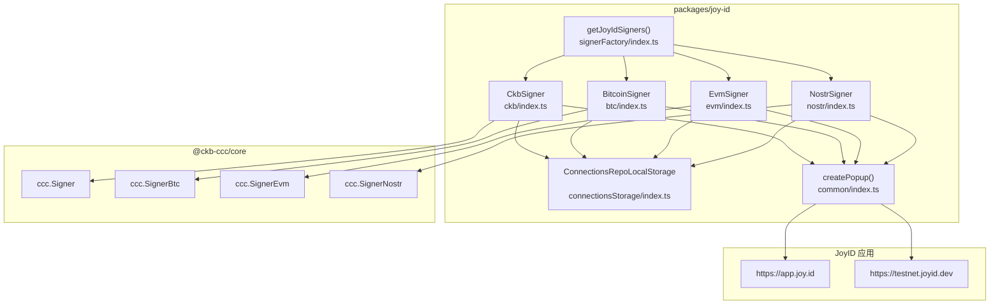
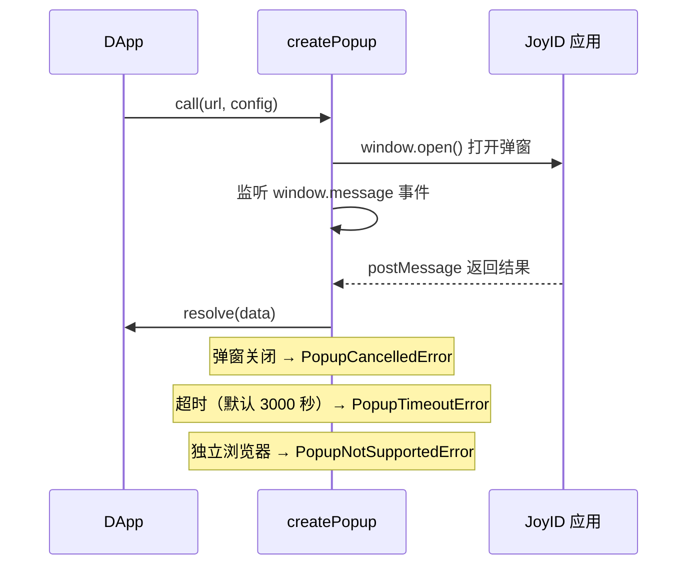

import { PackageBadges } from '@/components/package-badges';

[JoyID](https://joy.id/)是一款基于 WebAuthn / Passkey 的钱包，无需助记词，密钥通过设备生物识别（指纹、Face ID 等）管理。

`@ckb-ccc/joy-id` 是 CCC 中负责集成 JoyID 钱包的协议支持层包。它通过浏览器弹窗（popup）与 JoyID 应用通信，为 CKB、Bitcoin、EVM 和 Nostr 提供统一的 `Signer` 接口实现。

## 安装

<PackageBadges pkg="@ckb-ccc/joy-id" />

<Tabs items={['npm', 'yarn', 'pnpm']}>
  <Tab value="npm">
```bash
npm install @ckb-ccc/joy-id
```
  </Tab>
  <Tab value="yarn">
```bash
yarn add @ckb-ccc/joy-id
```
  </Tab>
  <Tab value="pnpm">
```bash
pnpm add @ckb-ccc/joy-id
```
  </Tab>
</Tabs>

**依赖：**

| 包 | 说明 |
|---------|-------------|
| `@ckb-ccc/core` | CCC 核心层——提供 `Signer`、`Client`、`Transaction` 等基础类型 |
| `@joyid/ckb` | JoyID CKB SDK——提供 `Aggregator`（COTA 聚合器） |
| `@joyid/common` | JoyID 通用工具——提供 `buildJoyIDURL`、`createBlockDialog`、`DappRequestType` 等 |

<Callout type="info">
  如果你使用的是 `@ckb-ccc/connector-react` 或 `@ckb-ccc/ccc`，JoyID 已内置其中，无需单独安装。
</Callout>

## 架构概览



## 核心类

### 1. `CkbSigner`

基于 JoyID Passkey 技术的 CKB 原生链 Signer，同时支持主密钥（`main_key`）和子密钥（`sub_key`，依赖 COTA 协议）。

**构造函数参数：**

```typescript
new CkbSigner(
  client: ccc.Client,          // CKB 节点客户端
  name: string,                // DApp 名称（显示在 JoyID 弹窗中）
  icon: string,                // DApp 图标 URL
  _appUri?: string,            // 自定义 JoyID App URL（可选，默认按网络自动选择）
  _aggregatorUri?: string,     // 自定义 COTA 聚合器 URL（可选）
  connectionsRepo?: ConnectionsRepo  // 连接存储（默认使用 localStorage）
)
```

**属性：**

| 属性 | 值 |
|----------|-------|
| `type` | `ccc.SignerType.CKB` |
| `signType` | `ccc.SignerSignType.JoyId` |

**默认端点：**

| 网络 | JoyID App URL | COTA 聚合器 URL |
|---------|--------------|---------------------|
| 主网（`ckb`） | `https://app.joy.id` | `https://cota.nervina.dev/mainnet-aggregator` |
| 测试网（`ckt`） | `https://testnet.joyid.dev` | `https://cota.nervina.dev/aggregator` |

**核心方法：**

- `connect()`——打开 JoyID 弹窗进行身份验证（`/auth`），获取地址、公钥和 `keyType`，并持久化到 localStorage。
- `disconnect()`——清除内存中的连接状态，并从 localStorage 中移除记录。
- `isConnected()`——检查内存中的连接状态；若不存在，尝试从 localStorage 恢复。
- `getInternalAddress()`——返回 JoyID CKB 地址字符串。
- `getIdentity()`——返回 JSON 字符串 `{ address, keyType, publicKey }`，用于签名验证。

<Callout>
注意：`publicKey` 已去除首字节（前缀 / 格式标识符），以适配签名验证的要求。
</Callout>

- `prepareTransaction(txLike)`——添加 JoyId 脚本的 Cell 依赖；若为 `sub_key` 账户，还会额外添加 COTA Cell 依赖和 SMT 解锁数据。
- `signOnlyTransaction(txLike)`——打开 JoyID 弹窗（`/sign-ckb-raw-tx`）完成交易签名。
- `signMessageRaw(message)`——打开 JoyID 弹窗（`/sign-message`）对消息进行签名，返回 JSON 字符串 `{ signature, alg, message }`。

**子密钥（Sub Key）机制：**

当 `keyType === "sub_key"` 时，`prepareTransaction` 会执行以下步骤：
1. 调用 COTA 聚合器的 `generateSubkeyUnlockSmt`，生成 SMT 解锁条目。
2. 将解锁数据写入 Witness 的 `outputType` 字段。
3. 在交易中前置 COTA Cell 依赖。

### 2. `BitcoinSigner`

支持 P2WPKH（原生 SegWit）和 P2TR（Taproot）两种地址类型。

**构造函数参数：**

```typescript
new BitcoinSigner(
  client: ccc.Client,
  name: string,
  icon: string,
  preferredNetworks?: ccc.NetworkPreference[],  // 默认为 btc / btcTestnet
  addressType?: "auto" | "p2wpkh" | "p2tr",     // 默认为 "auto"
  _appUri?: string,
  connectionsRepo?: ConnectionsRepo
)
```

**`addressType` 行为：**

| 值 | 行为 |
|-------|----------|
| `"auto"` | 根据用户 JoyID 账户的 `btcAddressType` 自动选择 |
| `"p2wpkh"` | 强制使用 Native SegWit 地址 |
| `"p2tr"` | 强制使用 Taproot 地址 |

**核心方法：**

- `connect()`——弹窗身份验证；根据 `addressType` 从响应中选择 `nativeSegwit` 或 `taproot`。
- `getBtcAccount()`——返回 Bitcoin 地址字符串。
- `getBtcPublicKey()`——返回 Bitcoin 公钥（`ccc.Hex`）。
- `signMessageRaw(message)`——使用 ECDSA（`signMessageType: "ecdsa"`）对消息进行签名。

### 3. `EvmSigner`

通过 JoyID 获取 Ethereum 地址并完成签名。

**构造函数参数：**

```typescript
new EvmSigner(
  client: ccc.Client,
  name: string,
  icon: string,
  _appUri?: string,
  connectionsRepo?: ConnectionsRepo
)
```

**核心方法：**

- `connect()`——弹窗身份验证；从响应中取 `ethAddress` 作为 EVM 账户地址。
- `getEvmAccount()`——返回 Ethereum 地址（`ccc.Hex`）。
- `signMessageRaw(message)`——对消息进行签名，返回 `ccc.Hex` 签名。

### 4. `NostrSigner`

通过 JoyID 获取 Nostr 公钥并对 Nostr 事件进行签名。

**构造函数参数：**

```typescript
new NostrSigner(
  client: ccc.Client,
  name: string,
  icon: string,
  _appUri?: string,
  connectionsRepo?: ConnectionsRepo
)
```

**核心方法：**

- `connect()`——弹窗身份验证；从响应中取 `nostrPubkey`。
- `getNostrPublicKey()`——返回 Nostr 公钥（`ccc.Hex`）。
- `signNostrEvent(event)`——打开弹窗（`/sign-nostr-event`）对 Nostr 事件签名，返回完整的 `Required<ccc.NostrEvent>`。

### 5. `getJoyIdSigners()` Factory 函数

推荐的集成入口——一次调用返回 JoyID 支持的所有 Signer。

**签名：**

```typescript
function getJoyIdSigners(
  client: ccc.Client,
  name: string,
  icon: string,
  preferredNetworks?: ccc.NetworkPreference[],
): ccc.SignerInfo[]
```

**标准浏览器环境下返回的 Signer 列表：**

| name | Signer 类型 |
|------|------------|
| `"CKB"` | `CkbSigner` |
| `"BTC"` | `BitcoinSigner`（auto） |
| `"Nostr"` | `NostrSigner` |
| `"EVM"` | `EvmSigner` |
| `"BTC (P2WPKH)"` | `BitcoinSigner`（p2wpkh） |
| `"BTC (P2TR)"` | `BitcoinSigner`（p2tr） |

**WebView / 独立浏览器兜底：**

在 WebView 或 PWA 独立模式下，JoyID 无法打开弹窗。Factory 函数为 CKB、EVM 和 BTC 返回 `ccc.SignerAlwaysError` 实例——调用任何方法均会抛出 `"JoyID can only be used with standard browsers"`。

## 连接存储管理

### `ConnectionsRepo` 接口

### `ConnectionsRepoLocalStorage`（默认实现）

以 JSON 数组形式将连接信息存储在 localStorage 的 `"ccc-joy-id-signer"` 键下。

**`Connection` 类型：**

```typescript
type Connection = {
  readonly address: string;    // 链地址
  readonly publicKey: ccc.Hex; // 公钥（十六进制格式）
  readonly keyType: string;    // "main_key" | "sub_key"
};
```

**`AccountSelector` 类型：**

```typescript
type AccountSelector = {
  uri: string;         // JoyID App URL
  addressType: string; // "ckb" | "btc-auto" | "btc-p2wpkh" | "btc-p2tr" | "ethereum" | "nostr"
};
```

**自定义存储：** 实现 `ConnectionsRepo` 接口即可替换默认的 localStorage 后端，例如使用 IndexedDB 或服务端存储。

## 弹窗通信机制

`createPopup()` 是所有 Signer 用于与 JoyID 应用通信的底层函数。

**流程：**



**错误类型：**

| 错误类 | 触发条件 |
|-------------|------------------|
| `PopupNotSupportedError` | 独立浏览器不支持弹窗 |
| `PopupCancelledError` | 用户手动关闭弹窗 |
| `PopupTimeoutError` | 操作超时（默认 3000 秒） |

## 与 `@ckb-ccc/ccc` 的集成

在 `@ckb-ccc/ccc` 的 `SignersController` 中，JoyID 以 `"JoyID Passkey"` 名称注册。

使用 `@ckb-ccc/connector-react` 时，JoyID 会自动出现在钱包选择界面，无需手工集成。

## 使用示例

### 示例 0：使用 `@ckb-ccc/connector-react`（推荐）

使用 CCC 连接器时，JoyID 自动注册：

```tsx
import { ccc } from "@ckb-ccc/connector-react";

export default function App({ children }) {
  return (
    <ccc.Provider name="My App" icon="/icon.png">
      {children}
    </ccc.Provider>
  );
}
```

用户打开钱包选择界面时，JoyID 即作为选项出现，无需任何额外配置。

### 示例 1：使用 Factory 函数集成

```typescript
import { ccc } from "@ckb-ccc/core";
import { getJoyIdSigners } from "@ckb-ccc/joy-id";

const client = new ccc.ClientPublicTestnet();

const signers = getJoyIdSigners(
  client,
  "My DApp",
  "https://my-dapp.com/icon.png",
);

// 获取 CKB Signer
const ckbSignerInfo = signers.find((s) => s.name === "CKB");
const signer = ckbSignerInfo!.signer;

await signer.connect();
const address = await signer.getRecommendedAddress();
console.log("CKB Address:", address);
```

### 示例 2：直接使用 `CkbSigner`

```typescript
import { ccc } from "@ckb-ccc/core";
import { CkbSigner } from "@ckb-ccc/joy-id";

const client = new ccc.ClientPublicMainnet();
const signer = new CkbSigner(client, "My DApp", "https://my-dapp.com/icon.png");

await signer.connect();

// 构建并发送交易
const tx = ccc.Transaction.from({
  outputs: [{ lock: await signer.getAddressObj().then((a) => a.script), capacity: ccc.fixedPointFrom(100) }],
  outputsData: ["0x"],
});
await tx.completeInputsByCapacity(signer);
await tx.completeFeeBy(signer, 1000);
const txHash = await signer.sendTransaction(tx);
console.log("TxHash:", txHash);
```

### 示例 3：自定义 COTA 聚合器（适用于 sub_key 账户）

```typescript
import { CkbSigner } from "@ckb-ccc/joy-id";

const signer = new CkbSigner(
  client,
  "My DApp",
  "https://my-dapp.com/icon.png",
  undefined,                                    // 使用默认 JoyID App URL
  "https://my-custom-aggregator.com/aggregator" // 自定义 COTA 聚合器
);
```

### 示例 4：消息签名与验证

```typescript
import { ccc } from "@ckb-ccc/core";
import { CkbSigner } from "@ckb-ccc/joy-id";

const signer = new CkbSigner(client, "My DApp", "https://icon.url");
await signer.connect();

const message = "Hello, CKB!";
const rawSig = await signer.signMessageRaw(message);
// rawSig 是 JSON 字符串：{ signature, alg, message }

const identity = await signer.getIdentity();
const isValid = await ccc.Signer.verifyMessage(message, {
  signType: ccc.SignerSignType.JoyId,
  signature: rawSig,
  identity,
});
```

### 示例 5：自定义连接存储

```typescript
import { CkbSigner, ConnectionsRepo, AccountSelector, Connection } from "@ckb-ccc/joy-id";

class MyCustomStorage implements ConnectionsRepo {
  async get(selector: AccountSelector): Promise<Connection | undefined> {
    // 从 IndexedDB 或服务端读取
  }
  async set(selector: AccountSelector, connection: Connection | undefined): Promise<void> {
    // 写入 IndexedDB 或服务端
  }
}

const signer = new CkbSigner(
  client, "My DApp", "https://icon.url",
  undefined, undefined,
  new MyCustomStorage()
);
```

## Lumos 兼容性

如果你使用 Lumos SDK，可通过 Lumos 补丁支持 JoyID：

```typescript
import { generateDefaultScriptInfos } from "@ckb-ccc/lumos-patches";

// 在使用 Lumos 前调用——无需 @ckb-lumos/joyid
registerCustomLockScriptInfos(generateDefaultScriptInfos());
```

详见 [@ckb-ccc/lumos-patches](../protocol-sdks/lumos-patches) 页面。

## 注意事项与限制

1. **仅限浏览器环境**：所有 Signer 依赖 `window.open`、`window.localStorage` 和 `window.postMessage`，不支持 Node.js 服务端环境。
2. **不支持 WebView**：在 WebView（如微信内置浏览器）或 PWA standalone 模式下，`getJoyIdSigners` 返回 `SignerAlwaysError` 实例，JoyID 无法使用。
3. **弹窗拦截**：浏览器可能拦截非用户手势触发的弹窗，`connect()` 和签名方法应在用户事件处理器（如点击按钮）中调用。
4. **Sub Key 依赖 COTA**：使用子密钥（sub_key）账户时，账户必须持有 COTA Cell，否则 `prepareTransaction` 会抛出 `"No COTA cells for sub key wallet"` 错误。
5. **消息签名格式**：`CkbSigner.signMessageRaw` 返回 JSON 字符串（包含 `signature`、`alg` 和 `message` 字段），而非原始签名字节。验证时须使用 `ccc.Signer.verifyMessage` 并指定 `SignerSignType.JoyId`。

## 参考资料

- [JoyID 官网](https://joy.id)