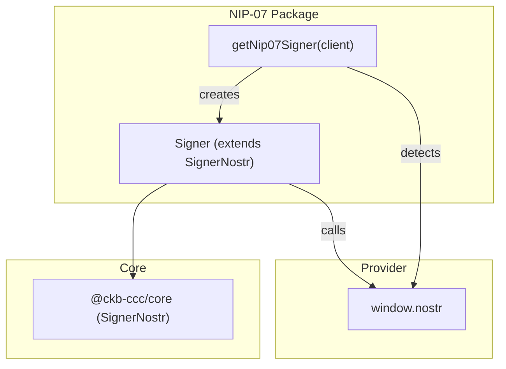
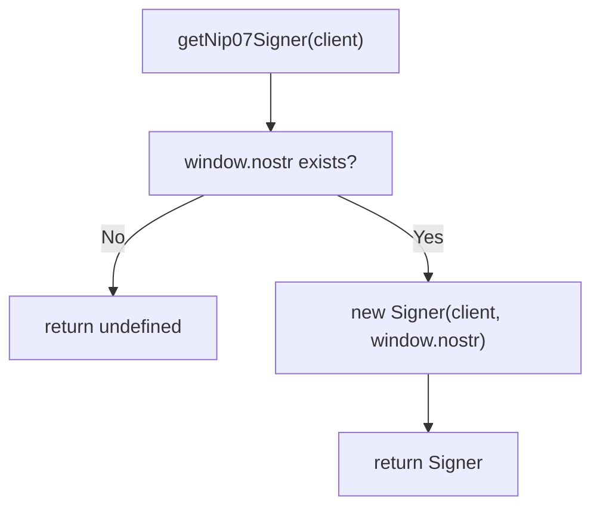
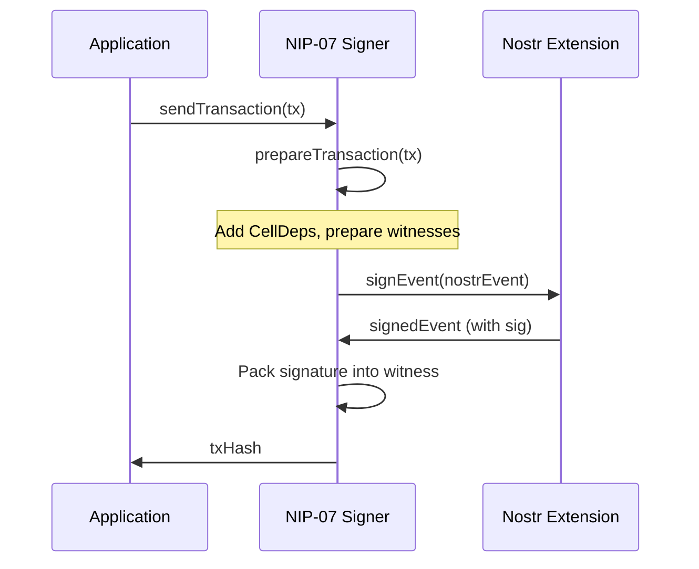

import { PackageBadges } from '@/components/package-badges';

`@ckb-ccc/nip07` lets any [NIP-07](https://github.com/nostr-protocol/nips/blob/master/07.md) compatible Nostr browser extension act as a CCC `Signer`. It derives a CKB address from the user's Nostr public key and signs CKB transactions via Nostr event signing.

<Callout type="info">
  If you're using `@ckb-ccc/connector-react` or `@ckb-ccc/ccc`, NIP-07 support is already included — no separate installation needed.
</Callout>

## Installation

<PackageBadges pkg="@ckb-ccc/nip07" />

<Tabs items={['npm', 'yarn', 'pnpm']}>
  <Tab value="npm">
    ```bash
    npm install @ckb-ccc/nip07
    ```
  </Tab>
  <Tab value="yarn">
    ```bash
    yarn add @ckb-ccc/nip07
    ```
  </Tab>
  <Tab value="pnpm">
    ```bash
    pnpm add @ckb-ccc/nip07
    ```
  </Tab>
</Tabs>

**Dependencies:**

| Package | Description |
| ------- | ----------- |
| `@ckb-ccc/core` | Base types — `Signer`, `Client`, `Transaction`, and more |

## Architecture

`@ckb-ccc/nip07` is a thin wrapper around the `window.nostr` object injected by NIP-07 extensions (e.g. nos2x, Alby).



### Entry point: `getNip07Signer`

`getNip07Signer(client)` checks for `window.nostr` and returns a `Signer` instance — or `undefined` if no NIP-07 extension is available:



## The `Signer` class

`Signer` extends `ccc.SignerNostr` and wraps a NIP-07 provider with public key caching.

### Key methods

| Method | Description |
| ------ | ----------- |
| `connect()` | Retrieves and caches the Nostr public key |
| `isConnected()` | Always returns `true` (NIP-07 extensions are always available once detected) |
| `getNostrPublicKey()` | Returns the cached Nostr public key (hex-encoded) |
| `signNostrEvent(event)` | Signs a Nostr event via `provider.signEvent()` |

### Public key caching

The Nostr public key is fetched once via `provider.getPublicKey()` and cached as a `Promise`. If the call fails, the cache is cleared so the next attempt retries:

```typescript
async getNostrPublicKey(): Promise<ccc.Hex> {
  if (!this.publicKeyCache) {
    this.publicKeyCache = this.provider.getPublicKey().catch((e) => {
      this.publicKeyCache = undefined;
      throw e;
    });
  }
  return ccc.hexFrom(await this.publicKeyCache);
}
```

### Signing flow

CKB transactions are signed by constructing a Nostr event and delegating to the extension:



## Provider interface

The NIP-07 provider interface is minimal:

| Method | Returns | Description |
| ------ | ------- | ----------- |
| `getPublicKey()` | `Promise<string>` | Returns the user's Nostr public key (hex) |
| `signEvent(event)` | `Promise<NostrEvent>` | Signs a Nostr event and returns it with the `sig` field |

## Integration pattern

`@ckb-ccc/nip07` follows the same integration contract as other wallet packages in CCC:

- **Factory function** — `getNip07Signer` returns a `Signer` or `undefined`.
- **Provider detection** — checks for `window.nostr` before creating the signer.
- **Graceful degradation** — returns `undefined` when no NIP-07 extension is installed.

This package is also used as a dependency by `@ckb-ccc/okx` for its Nostr signing support.
