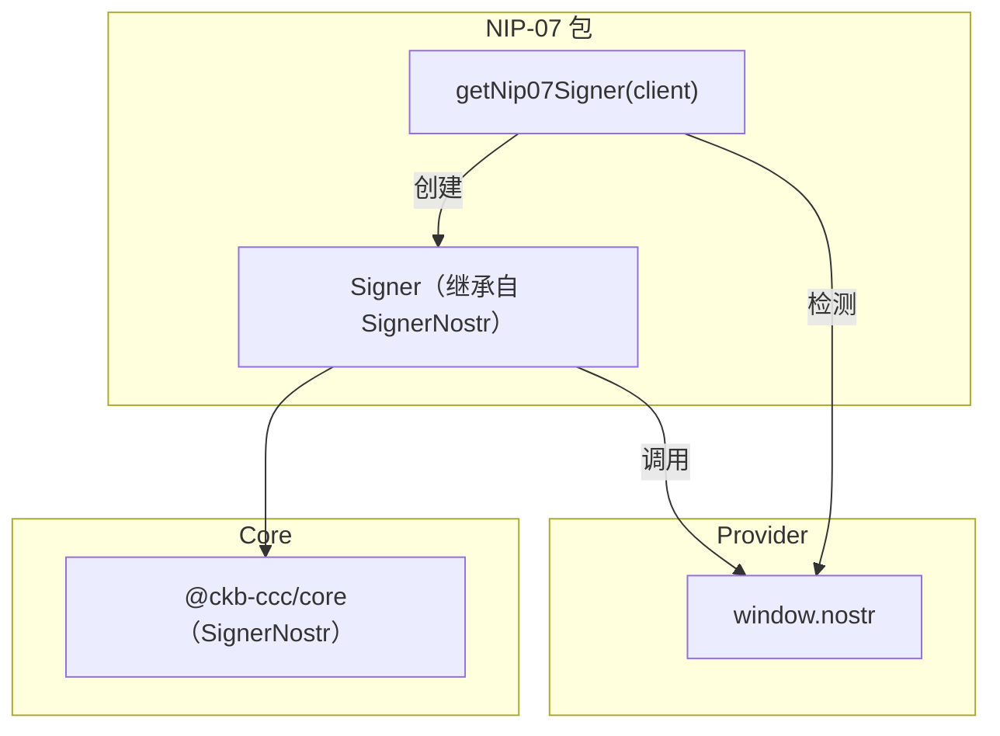
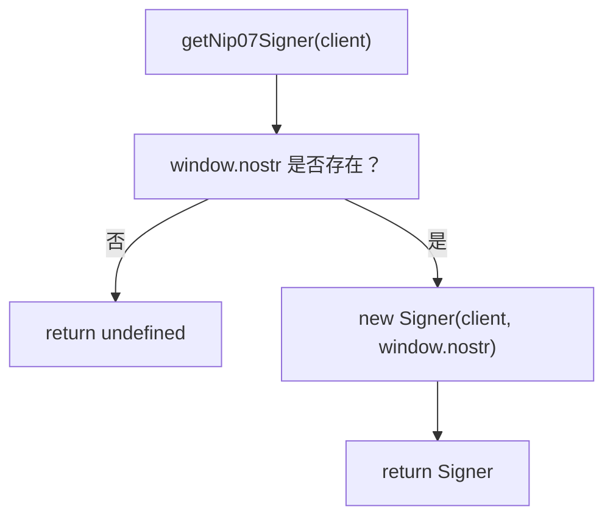
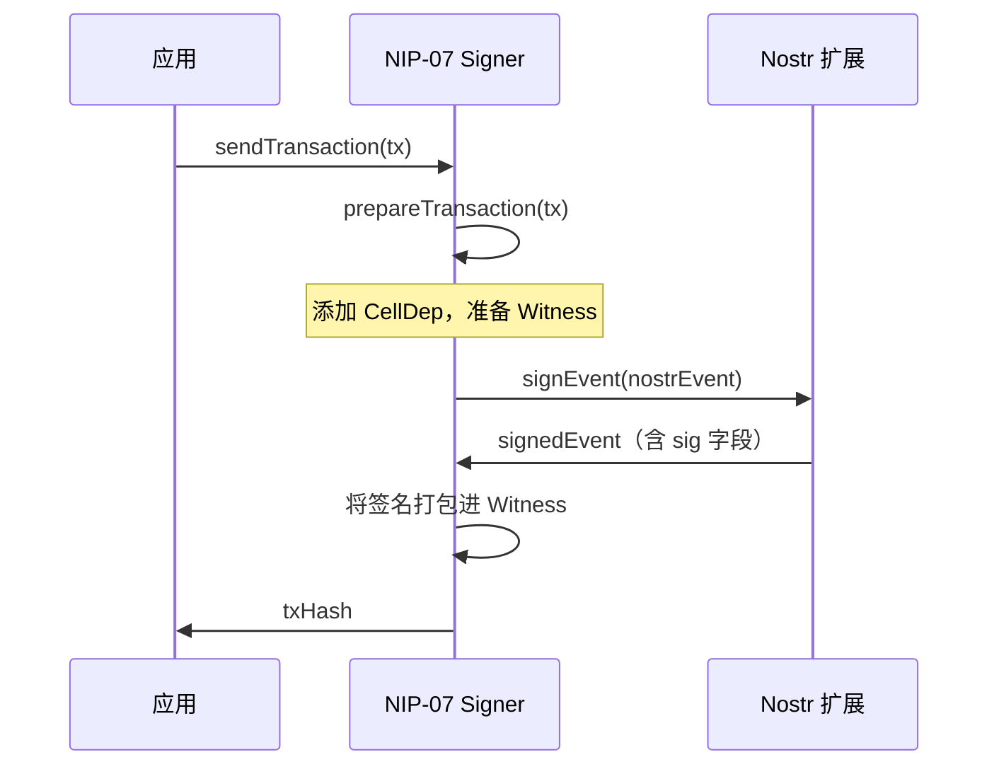

import { PackageBadges } from '@/components/package-badges';

`@ckb-ccc/nip07` 使任意兼容 [NIP-07](https://github.com/nostr-protocol/nips/blob/master/07.md) 的 Nostr 浏览器扩展作为 CCC `Signer` 接入。它从用户的 Nostr 公钥派生 CKB 地址，并通过 Nostr 事件签名对 CKB 交易进行签名。

<Callout type="info">
  如果你使用的是 `@ckb-ccc/connector-react` 或 `@ckb-ccc/ccc`，NIP-07 支持已内置其中，无需单独安装。
</Callout>

## 安装

<PackageBadges pkg="@ckb-ccc/nip07" />

<Tabs items={['npm', 'yarn', 'pnpm']}>
  <Tab value="npm">
    ```bash
    npm install @ckb-ccc/nip07
    ```
  </Tab>
  <Tab value="yarn">
    ```bash
    yarn add @ckb-ccc/nip07
    ```
  </Tab>
  <Tab value="pnpm">
    ```bash
    pnpm add @ckb-ccc/nip07
    ```
  </Tab>
</Tabs>

**依赖：**

| 包 | 说明 |
| ------- | ----------- |
| `@ckb-ccc/core` | 基础类型——`Signer`、`Client`、`Transaction` 等 |

## 架构

`@ckb-ccc/nip07` 是对 NIP-07 扩展（如 nos2x、Alby）注入的 `window.nostr` 对象的轻量封装。



### 入口：`getNip07Signer`

`getNip07Signer(client)` 检查 `window.nostr` 是否存在，若存在则返回 `Signer` 实例，否则返回 `undefined`：



## `Signer` 类

`Signer` 继承自 `ccc.SignerNostr`，在 NIP-07 Provider 基础上添加了公钥缓存。

### 核心方法

| 方法 | 说明 |
| ------ | ----------- |
| `connect()` | 获取并缓存 Nostr 公钥 |
| `isConnected()` | 始终返回 `true`（检测到 NIP-07 扩展后即视为已连接） |
| `getNostrPublicKey()` | 返回已缓存的 Nostr 公钥（十六进制编码） |
| `signNostrEvent(event)` | 通过 `provider.signEvent()` 对 Nostr 事件进行签名 |

### 公钥缓存

Nostr 公钥通过 `provider.getPublicKey()` 获取一次后以 `Promise` 形式缓存。若调用失败，缓存会被清除，下次调用时重新获取：

```typescript
async getNostrPublicKey(): Promise<ccc.Hex> {
  if (!this.publicKeyCache) {
    this.publicKeyCache = this.provider.getPublicKey().catch((e) => {
      this.publicKeyCache = undefined;
      throw e;
    });
  }
  return ccc.hexFrom(await this.publicKeyCache);
}
```

### 签名流程

CKB 交易通过构造 Nostr 事件并委托给扩展完成签名：



## Provider 接口

NIP-07 Provider 接口较为精简：

| 方法 | 返回值 | 说明 |
| ------ | ------- | ----------- |
| `getPublicKey()` | `Promise<string>` | 返回用户的 Nostr 公钥（十六进制） |
| `signEvent(event)` | `Promise<NostrEvent>` | 对 Nostr 事件签名并返回附带 `sig` 字段的结果 |

## 集成模式

`@ckb-ccc/nip07` 遵循 CCC 中其他钱包包相同的集成约定：

- **Factory 函数**——`getNip07Signer` 返回 `Signer` 或 `undefined`。
- **Provider 检测**——创建 Signer 前先检查 `window.nostr` 是否存在。
- **优雅降级**——未安装 NIP-07 扩展时返回 `undefined`。

`@ckb-ccc/okx` 也将本包作为依赖，用于其 Nostr 签名支持。