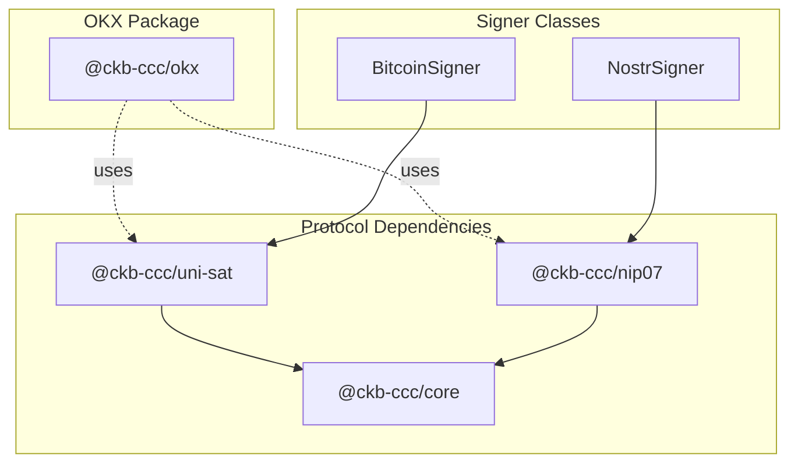
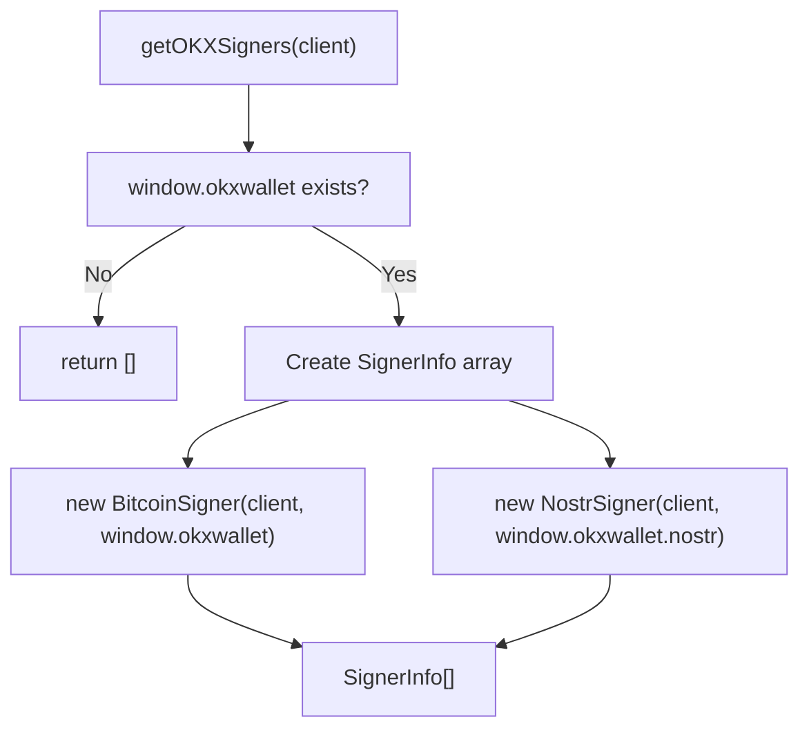
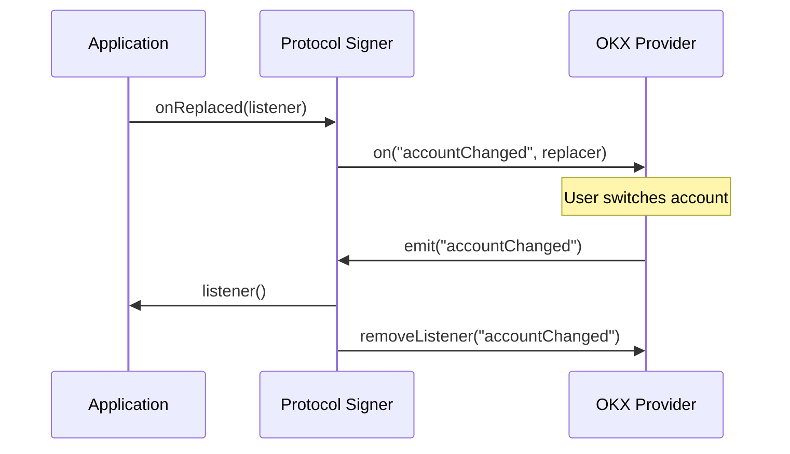

import { PackageBadges } from '@/components/package-badges';

`@ckb-ccc/okx` integrates OKX Wallet into CCC, providing `Signer` implementations for Bitcoin and Nostr protocols. It communicates with the wallet via the browser-injected `window.okxwallet` object and reuses protocol implementations from `@ckb-ccc/uni-sat` and `@ckb-ccc/nip07` rather than reimplementing them from scratch.

<Callout type="info">
  If you're using `@ckb-ccc/connector-react` or `@ckb-ccc/ccc`, OKX is already included — no separate installation needed.
</Callout>

## Installation

<PackageBadges pkg="@ckb-ccc/okx" />

<Tabs items={['npm', 'yarn', 'pnpm']}>
  <Tab value="npm">
    ```bash
    npm install @ckb-ccc/okx
    ```
  </Tab>
  <Tab value="yarn">
    ```bash
    yarn add @ckb-ccc/okx
    ```
  </Tab>
  <Tab value="pnpm">
    ```bash
    pnpm add @ckb-ccc/okx
    ```
  </Tab>
</Tabs>

**Dependencies:**

| Package            | Description |
| ------------------ | ----------- |
| `@ckb-ccc/core`    | Base types — `Signer`, `Client`, `Transaction`, and more |
| `@ckb-ccc/nip07`   | NIP-07 protocol support — Nostr signer implementation |
| `@ckb-ccc/uni-sat` | UniSat protocol support — Bitcoin provider interface |

## Architecture

`@ckb-ccc/okx` composes existing single-protocol packages rather than reimplementing them:



### Entry point: `getOKXSigners`

`getOKXSigners(client)` is the main entry point. It checks for `window.okxwallet` and returns a `SignerInfo[]` array — empty if the wallet isn't available:



## Bitcoin protocol

`BitcoinSigner` extends `ccc.SignerBtc` and adapts the UniSat provider interface for OKX.

### Network support

| Network key | Chain | Network type | Provider access |
| ----------- | ----- | ------------ | --------------- |
| `btc` | `bitcoin` | Mainnet | `this.providers.bitcoin` |

<Callout type="warning">
  OKX only supports Bitcoin mainnet. While the code includes mappings for `btcTestnet` and `btcSignet`, OKX no longer provides providers for these networks, so they are not actually available. See [the announcement](https://www.okx.com/help/okx-wallet-to-cease-support-for-the-btc-testnet) for details.
</Callout>

### Account and public key retrieval

`BitcoinSigner` supports two methods to accommodate different OKX provider versions:

- **`getAccounts()`** — returns an array of addresses.
- **`getSelectedAccount()`** — returns the currently selected account.

## Nostr protocol

`NostrSigner` wraps the provider interfaces from `@ckb-ccc/nip07` with two additions:

- **Public key caching** — `publicKeyCache` avoids redundant RPC calls.
- **Event signing** — delegates to `this.provider.signEvent` after ensuring the public key is attached.

## Account change detection

Both `BitcoinSigner` and `NostrSigner` implement `onReplaced()` to keep connection state in sync when the user switches accounts in the wallet UI:



`onReplaced()` registers a listener for `"accountChanged"`, invokes the application callback when triggered, and returns a cleanup function that removes the listener.

## Integration pattern

`@ckb-ccc/okx` follows the same integration contract as every other wallet package in CCC:

- **Factory function** — `getOKXSigners` returns a `SignerInfo[]` array.
- **Provider detection** — checks for `window.okxwallet` before creating any signers.
- **Graceful degradation** — returns an empty array when the wallet is unavailable or incompatible.

This means `SignersController` can treat OKX exactly like any other signer source, with no special-casing required in application code.