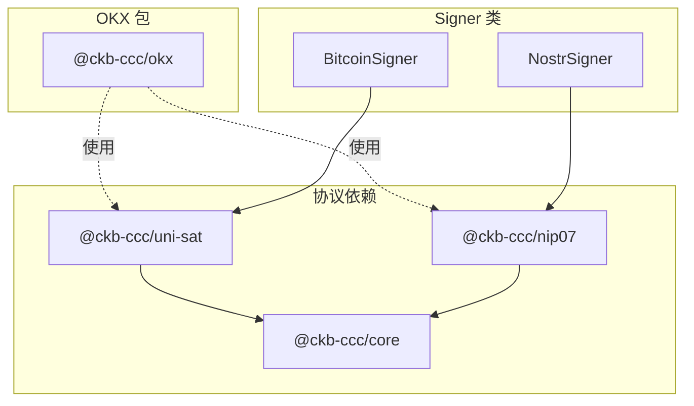
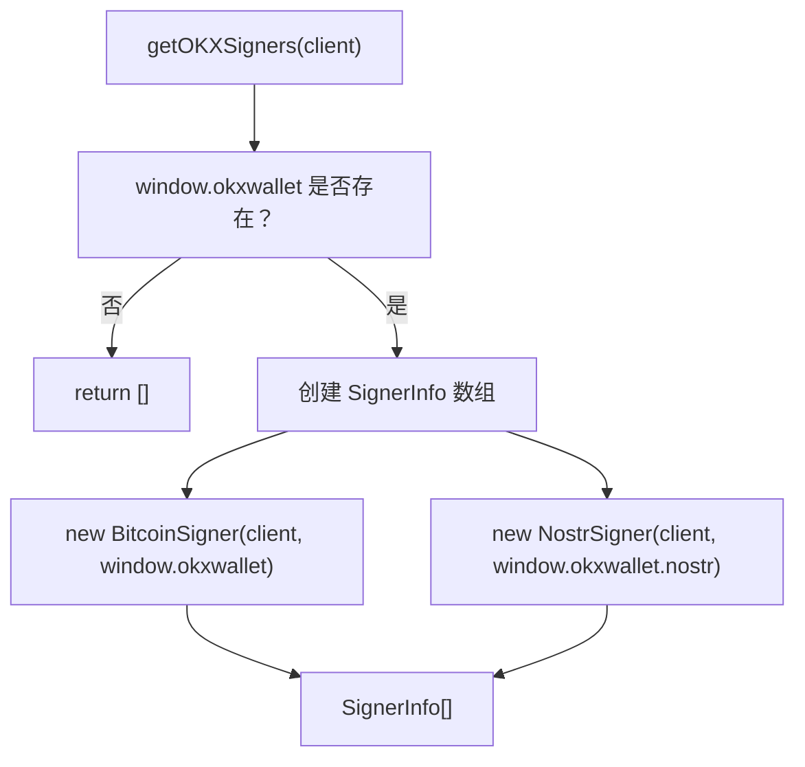
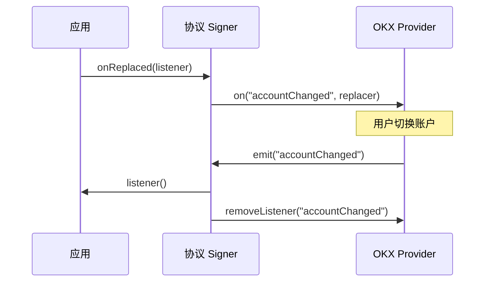

import { PackageBadges } from '@/components/package-badges';

`@ckb-ccc/okx` 将 OKX Wallet 集成至 CCC，为 Bitcoin 和 Nostr 协议提供 `Signer` 实现。它通过浏览器注入的 `window.okxwallet` 对象与钱包通信，并复用 `@ckb-ccc/uni-sat` 和 `@ckb-ccc/nip07` 的协议实现，而非从头重写。

<Callout type="info">
  如果你使用的是 `@ckb-ccc/connector-react` 或 `@ckb-ccc/ccc`，OKX 已内置其中，无需单独安装。
</Callout>

## 安装

<PackageBadges pkg="@ckb-ccc/okx" />

<Tabs items={['npm', 'yarn', 'pnpm']}>
  <Tab value="npm">
    ```bash
    npm install @ckb-ccc/okx
    ```
  </Tab>
  <Tab value="yarn">
    ```bash
    yarn add @ckb-ccc/okx
    ```
  </Tab>
  <Tab value="pnpm">
    ```bash
    pnpm add @ckb-ccc/okx
    ```
  </Tab>
</Tabs>

**依赖：**

| 包 | 说明 |
| ------------------ | ----------- |
| `@ckb-ccc/core`    | 基础类型——`Signer`、`Client`、`Transaction` 等 |
| `@ckb-ccc/nip07`   | NIP-07 协议支持——Nostr Signer 实现 |
| `@ckb-ccc/uni-sat` | UniSat 协议支持——Bitcoin Provider 接口 |

## 架构

`@ckb-ccc/okx` 复用现有的单协议包，而非重新实现：



### 入口：`getOKXSigners`

`getOKXSigners(client)` 是主入口，检查 `window.okxwallet` 是否存在，并返回 `SignerInfo[]` 数组——钱包不可用时返回空数组：



## Bitcoin 协议

`BitcoinSigner` 继承自 `ccc.SignerBtc`，将 UniSat Provider 接口适配为 OKX 的实现。

### 网络支持

| 网络键值       | 链      | 网络类型 | Provider 访问路径         |
| -------------- | ------- | -------- | ------------------------- |
| `btc`          | bitcoin | 主网     | `this.providers.bitcoin`  |

<Callout type="warning">
  OKX 仅支持 Bitcoin 主网。虽然代码中保留了 `btcTestnet` 和 `btcSignet` 的映射，但 OKX 已不再为这些网络提供 Provider，实际上无法使用。详见[官方公告](https://www.okx.com/help/okx-wallet-to-cease-support-for-the-btc-testnet)。
</Callout>

### 账户与公钥获取

`BitcoinSigner` 提供两种方式获取账户，以兼容不同版本的 OKX Provider：

- **`getAccounts()`**——返回地址数组。
- **`getSelectedAccount()`**——返回当前选中的账户。

## Nostr 协议

`NostrSigner` 在 `@ckb-ccc/nip07` Provider 接口基础上新增了两项功能：

- **公钥缓存**——`publicKeyCache` 避免重复发起 RPC 调用。
- **事件签名**——确认公钥已附加后，委托给 `this.provider.signEvent` 执行签名。

## 账户变更检测

`BitcoinSigner` 和 `NostrSigner` 均实现了 `onReplaced()`，在用户于钱包界面切换账户时保持连接状态同步：



`onReplaced()` 注册 `"accountChanged"` 监听器，触发时调用应用回调，并返回用于移除该监听器的清理函数。

## 集成模式

`@ckb-ccc/okx` 遵循 CCC 中所有钱包包相同的集成约定：

- **Factory 函数**——`getOKXSigners` 返回 `SignerInfo[]` 数组。
- **Provider 检测**——创建任何 Signer 前先检查 `window.okxwallet` 是否存在。
- **优雅降级**——钱包不可用或不兼容时返回空数组。

因此，`SignersController` 可以像对待其他任意 Signer 来源一样处理 OKX，应用代码无需针对它做特殊处理。
