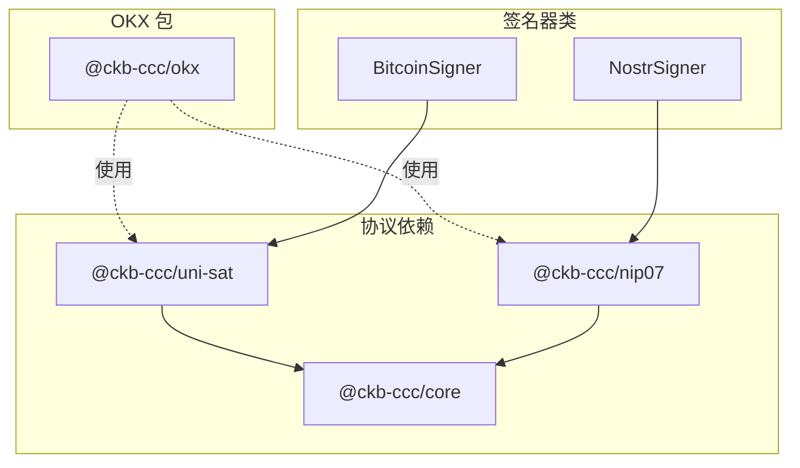
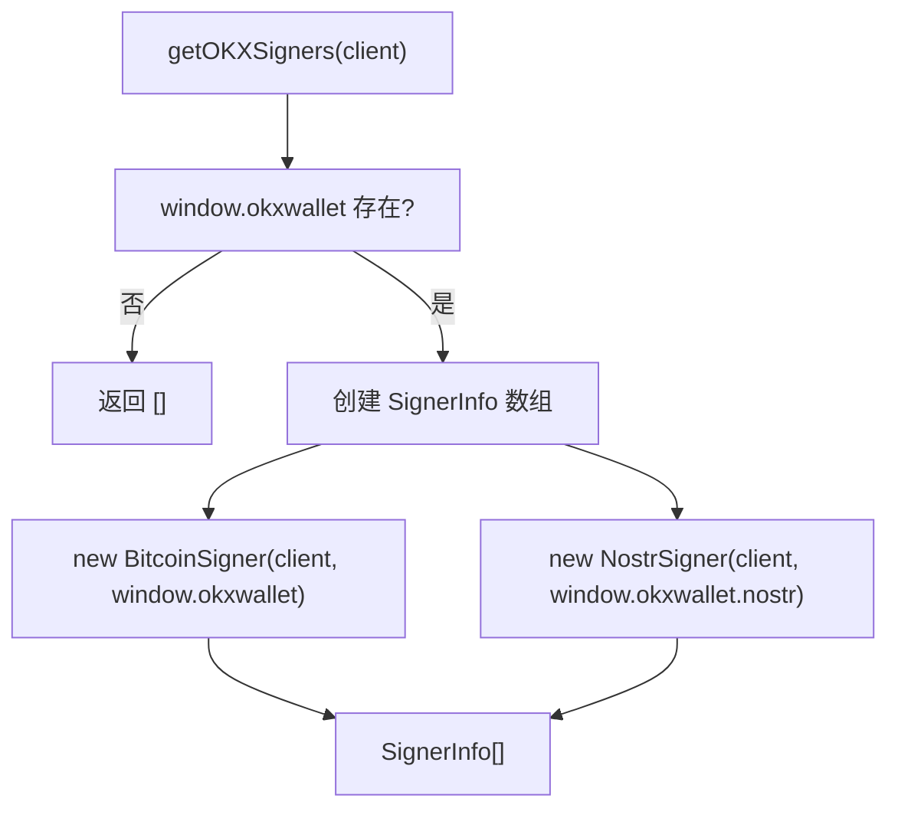
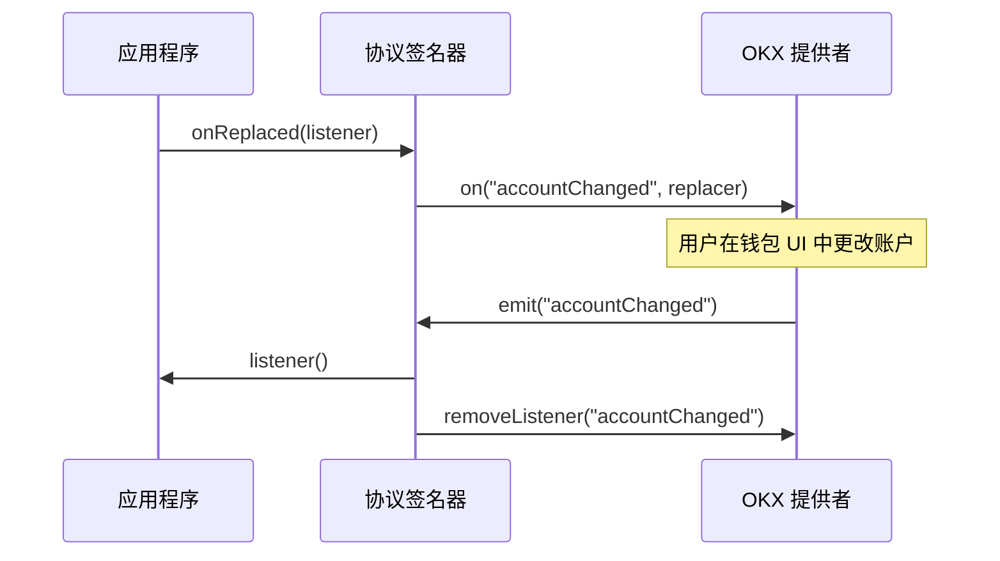

import { PackageBadges } from '@/components/package-badges';

`@ckb-ccc/okx` 是 CCC 中的协议支持层包，负责集成 OKX 钱包。OKX 是一个多协议钱包，支持比特币和 Nostr 协议。该包通过浏览器注入的 `window.okxwallet` 对象与 OKX 钱包通信，并为比特币和 Nostr 提供统一的 `Signer` 接口实现。OKX 包采用复合依赖架构，复用 `@ckb-ccc/uni-sat` 和 `@ckb-ccc/nip07` 的实现来提供协议支持。 

<Callout type="info">
  如果您正在使用 `@ckb-ccc/connector-react` 或 `@ckb-ccc/ccc`，OKX 已经包含在内 — 无需单独安装。
</Callout>

## 安装

<PackageBadges pkg="@ckb-ccc/okx" />

<Tabs items={['npm', 'yarn', 'pnpm']}>
  <Tab value="npm">
```bash
npm install @ckb-ccc/okx
```
  </Tab>
  <Tab value="yarn">
```bash
yarn add @ckb-ccc/okx
```
  </Tab>
  <Tab value="pnpm">
```bash
pnpm add @ckb-ccc/okx
```
  </Tab>
</Tabs>

**依赖项：**

| 包                 | 描述                         |
|--------------------|------------------------------|
| `@ckb-ccc/core`    | CCC 核心层 — 提供 `Signer`、`Client`、`Transaction` 等基础类型 |
| `@ckb-ccc/nip07`   | NIP-07 协议支持 — 提供 Nostr 签名器实现 |
| `@ckb-ccc/uni-sat` | UniSat 协议支持 — 提供比特币提供者接口 |

## 架构概览

OKX 包采用复合依赖架构，通过组合现有的单协议实现来提供多协议支持，而不是从头重新实现。



### 签名器工厂模式

`getOKXSigners` 函数是 OKX 包的核心入口，它检测浏览器环境中是否存在 `window.okxwallet` 对象，并返回相应的签名器信息数组。

**OKX 签名器创建流程**



## 比特币协议实现

OKX 的比特币支持通过 `BitcoinSigner` 类实现，该类继承自 `ccc.SignerBtc` 并扩展了 UniSat 提供者接口。

### 网络支持

| 网络键 | 链名称 | 网络类型 | 提供者访问 |
| :--- | :--- | :--- | :--- |
| `btc` | `bitcoin` | 主网 | `this.providers.bitcoin` |

<Callout type="info">
  OKX 目前只支持比特币主网。虽然代码中包含了 `btcTestnet` 和 `btcSignet` 的映射，但 OKX 已不再提供这些网络的 provider，因此实际上不可用。详见 [OKX 官方公告](https://www.okx.com/zh-hans/help/okx-wallet-to-cease-support-for-the-btc-testnet)。
</Callout>

### 账户和公钥获取

`BitcoinSigner` 提供两种方式获取比特币账户地址和公钥，以兼容不同版本的 OKX 提供者：

1. **通过 `getAccounts`**：使用提供者的 `getAccounts()` 方法获取地址数组
2. **通过 `getSelectedAccount`**：使用提供者的 `getSelectedAccount()` 方法获取当前选中账户

## Nostr 协议实现

OKX 的 Nostr 支持通过 `NostrSigner` 类实现，该类利用 `@ckb-ccc/nip07` 包的提供者接口。

### Nostr 签名器逻辑

- **公钥缓存**：使用 `publicKeyCache` 避免冗余的 RPC 调用
- **事件签名**：在确保公钥已附加后，委托给 `this.provider.signEvent` 进行签名

## 账户变更检测

OKX 包实现了基于事件的账户变更检测机制，以维护钱包提供者和应用程序之间的连接状态同步。

### 账户变更流程



比特币和 Nostr 签名器都实现了 `onReplaced()` 方法模式：
1. 为 `"accountChanged"` 事件注册监听器
2. 返回一个清理函数，用于移除监听器
3. 当账户变更发生时调用应用程序回调

## 集成模式

OKX 钱包通过一致的模式集成到 CCC 系统中：<Cite path="packages/ccc/src/signersController.ts" start="155" end="160" />

1. **工厂函数**：提供 `getOKXSigners` 工厂函数，返回 `SignerInfo[]` 数组
2. **提供者检测**：检查浏览器注入的提供者对象（`window.okxwallet`）
3. **条件创建**：仅在钱包提供者可用时创建签名器
4. **错误处理**：当钱包不可用或不兼容时优雅降级（返回空数组）

在主 CCC 包中，`SignersController` 导入并导出这些工厂函数，以提供统一的多链钱包访问。