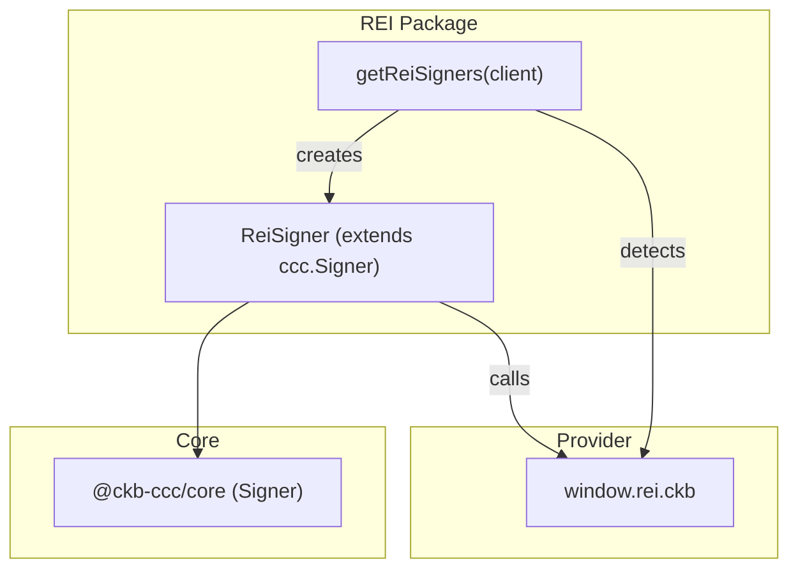
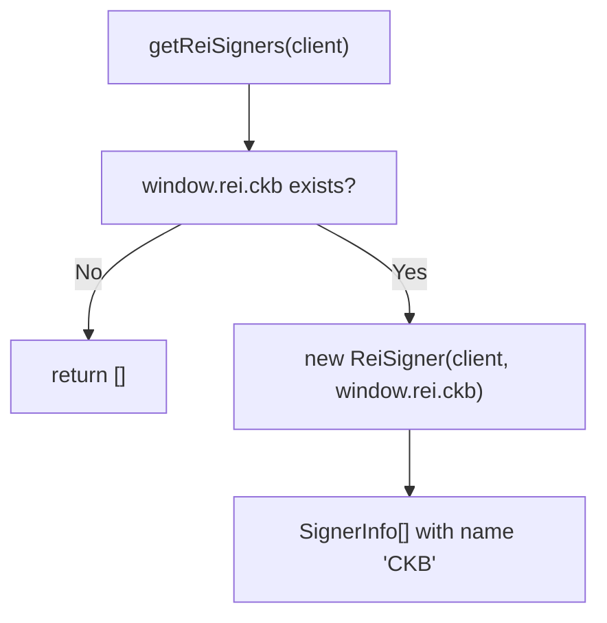
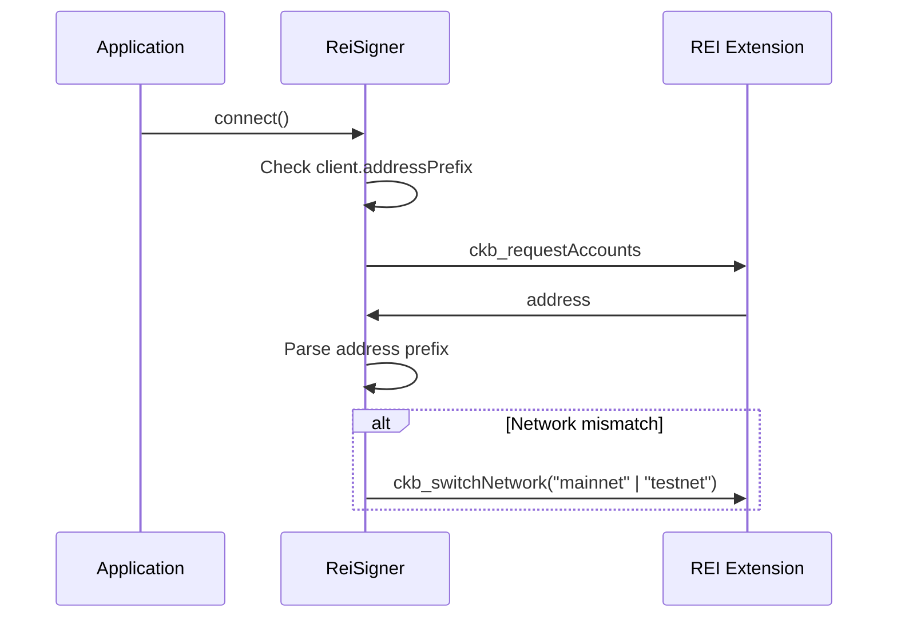
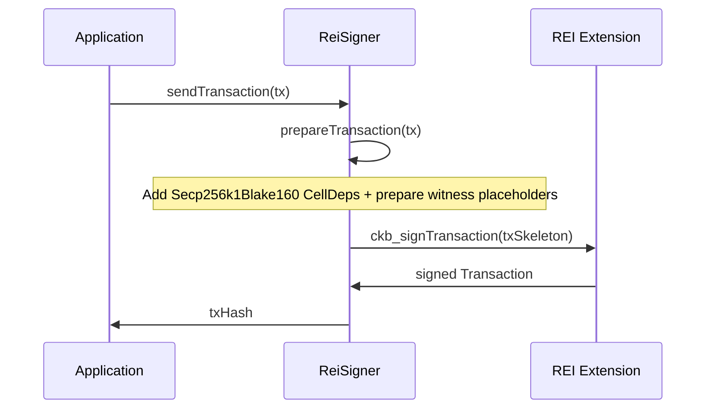

import { PackageBadges } from '@/components/package-badges';

`@ckb-ccc/rei` integrates [REI Wallet](https://reiwallet.io/) into CCC, providing a native CKB `Signer` implementation. REI is a CKB-native browser extension wallet that supports direct Secp256k1-Blake160 signing — no cross-chain address derivation needed.

<Callout type="info">
  If you're using `@ckb-ccc/connector-react` or `@ckb-ccc/ccc`, REI is already included — no separate installation needed.
</Callout>

## Installation

<PackageBadges pkg="@ckb-ccc/rei" />

<Tabs items={['npm', 'yarn', 'pnpm']}>
  <Tab value="npm">
    ```bash
    npm install @ckb-ccc/rei
    ```
  </Tab>
  <Tab value="yarn">
    ```bash
    yarn add @ckb-ccc/rei
    ```
  </Tab>
  <Tab value="pnpm">
    ```bash
    pnpm add @ckb-ccc/rei
    ```
  </Tab>
</Tabs>

**Dependencies:**

| Package | Description |
| ------- | ----------- |
| `@ckb-ccc/core` | Base types — `Signer`, `Client`, `Transaction`, and more |

## Architecture

`@ckb-ccc/rei` directly extends `ccc.Signer` (not a cross-chain signer) since REI is a CKB-native wallet.



### Entry point: `getReiSigners`

`getReiSigners(client)` checks for `window.rei.ckb` and returns a `SignerInfo[]` array — empty if the wallet isn't available:



## The `ReiSigner` class

`ReiSigner` extends `ccc.Signer` directly and communicates with the REI extension via its injected provider.

### Signer properties

| Property | Value |
| -------- | ----- |
| `type` | `SignerType.CKB` |
| `signType` | `SignerSignType.CkbSecp256k1` |

### Key methods

| Method | Description |
| ------ | ----------- |
| `connect()` | Switches REI to the correct network (mainnet/testnet) to match `client` |
| `isConnected()` | Returns `true` if connected AND on the matching network |
| `getInternalAddress()` | Calls `ckb_requestAccounts` to get the CKB address |
| `getIdentity()` | Calls `ckb_getPublicKey` to get the public key |
| `signMessageRaw(message)` | Signs via `ckb_signMessage` |
| `signOnlyTransaction(tx)` | Signs via `ckb_signTransaction` |
| `prepareTransaction(tx)` | Adds Secp256k1-Blake160 cell deps and prepares witnesses |
| `onReplaced(listener)` | Fires on `accountsChanged` or `chainChanged` events |

### Network auto-switching

On `connect()`, `ReiSigner` automatically switches the wallet to match the `client`'s network:



### Transaction signing

REI handles full transaction signing natively — no witness pre-computation needed on the CCC side:



## Account change detection

`ReiSigner` implements `onReplaced()` to keep state in sync:

- Listens for `"accountsChanged"` — user switched account
- Listens for `"chainChanged"` — user switched network

When either fires, the application callback is invoked and the listener is cleaned up.

## Provider interface

| Method | Description |
| ------ | ----------- |
| `ckb_requestAccounts` | Get the current CKB address |
| `ckb_getPublicKey` | Get the account's public key |
| `ckb_signMessage` | Sign an arbitrary message |
| `ckb_signTransaction` | Sign a full CKB transaction |
| `ckb_switchNetwork` | Switch between mainnet/testnet |
| `isConnected()` | Check wallet connection status |

## Integration pattern

`@ckb-ccc/rei` follows the same integration contract as every other wallet package in CCC:

- **Factory function** — `getReiSigners` returns a `SignerInfo[]` array.
- **Provider detection** — checks for `window.rei.ckb` before creating signers.
- **Graceful degradation** — returns an empty array when the wallet is unavailable.