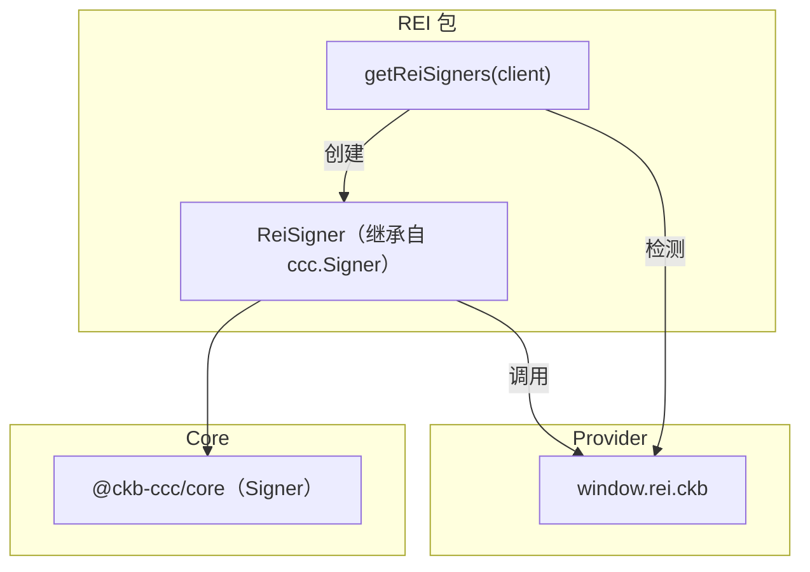
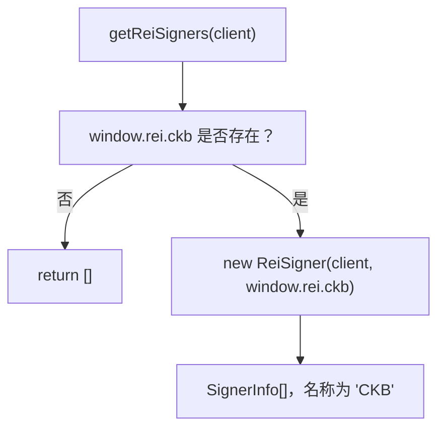
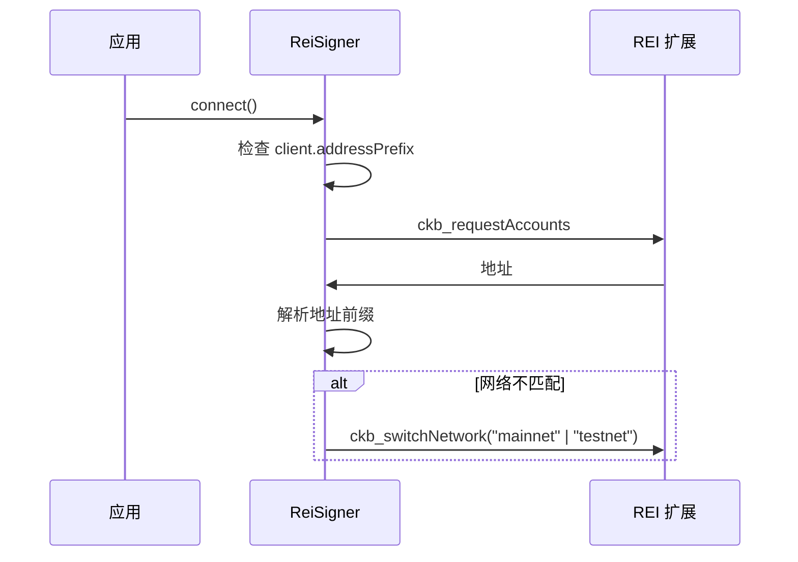
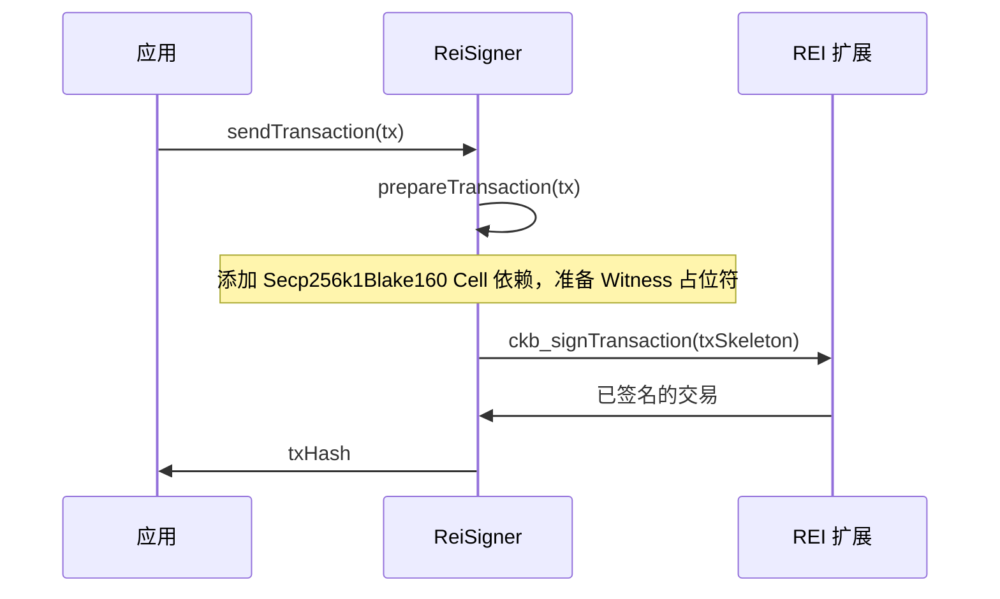

import { PackageBadges } from '@/components/package-badges';

`@ckb-ccc/rei` 将 [REI Wallet](https://reiwallet.io/) 集成至 CCC，提供原生 CKB `Signer` 实现。REI 是一款 CKB 原生浏览器扩展钱包，支持直接使用 Secp256k1-Blake160 签名，无需跨链地址派生。

<Callout type="info">
  如果你使用的是 `@ckb-ccc/connector-react` 或 `@ckb-ccc/ccc`，REI 已内置其中，无需单独安装。
</Callout>

## 安装

<PackageBadges pkg="@ckb-ccc/rei" />

<Tabs items={['npm', 'yarn', 'pnpm']}>
  <Tab value="npm">
    ```bash
    npm install @ckb-ccc/rei
    ```
  </Tab>
  <Tab value="yarn">
    ```bash
    yarn add @ckb-ccc/rei
    ```
  </Tab>
  <Tab value="pnpm">
    ```bash
    pnpm add @ckb-ccc/rei
    ```
  </Tab>
</Tabs>

**依赖：**

| 包 | 说明 |
| ------- | ----------- |
| `@ckb-ccc/core` | 基础类型——`Signer`、`Client`、`Transaction` 等 |

## 架构

由于 REI 是 CKB 原生钱包，`@ckb-ccc/rei` 直接继承 `ccc.Signer`，而非跨链 Signer。



### 入口：`getReiSigners`

`getReiSigners(client)` 检查 `window.rei.ckb` 是否存在，并返回 `SignerInfo[]` 数组——钱包不可用时返回空数组：



## `ReiSigner` 类

`ReiSigner` 直接继承 `ccc.Signer`，通过 REI 扩展注入的 Provider 与其通信。

### Signer 属性

| 属性 | 值 |
| -------- | ----- |
| `type` | `SignerType.CKB` |
| `signType` | `SignerSignType.CkbSecp256k1` |

### 核心方法

| 方法 | 说明 |
| ------ | ----------- |
| `connect()` | 将 REI 切换至与 `client` 匹配的网络（主网 / 测试网） |
| `isConnected()` | 已连接且网络匹配时返回 `true` |
| `getInternalAddress()` | 调用 `ckb_requestAccounts` 获取 CKB 地址 |
| `getIdentity()` | 调用 `ckb_getPublicKey` 获取公钥 |
| `signMessageRaw(message)` | 通过 `ckb_signMessage` 签名 |
| `signOnlyTransaction(tx)` | 通过 `ckb_signTransaction` 签名 |
| `prepareTransaction(tx)` | 添加 Secp256k1-Blake160 Cell 依赖并准备 Witness |
| `onReplaced(listener)` | 在 `accountsChanged` 或 `chainChanged` 事件触发时调用 |

### 网络自动切换

调用 `connect()` 时，`ReiSigner` 自动将钱包切换到与 `client` 网络匹配的环境：



### 交易签名

REI 原生处理完整的交易签名，CCC 侧无需预计算 Witness：



## 账户变更检测

`ReiSigner` 通过 `onReplaced()` 保持状态同步：

- 监听 `"accountsChanged"`——用户切换了账户
- 监听 `"chainChanged"`——用户切换了网络

任一事件触发时，应用回调会被调用，监听器随即自动清理。

## Provider 接口

| 方法 | 说明 |
| ------ | ----------- |
| `ckb_requestAccounts` | 获取当前 CKB 地址 |
| `ckb_getPublicKey` | 获取账户公钥 |
| `ckb_signMessage` | 对任意消息进行签名 |
| `ckb_signTransaction` | 对完整 CKB 交易进行签名 |
| `ckb_switchNetwork` | 在主网 / 测试网之间切换 |
| `isConnected()` | 检查钱包连接状态 |

## 集成模式

`@ckb-ccc/rei` 遵循 CCC 中所有钱包包相同的集成约定：

- **Factory 函数**——`getReiSigners` 返回 `SignerInfo[]` 数组。
- **Provider 检测**——创建 Signer 前先检查 `window.rei.ckb` 是否存在。
- **优雅降级**——钱包不可用时返回空数组。