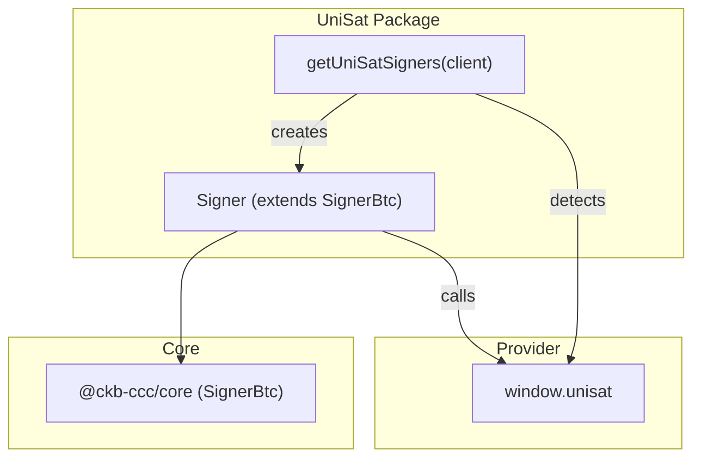
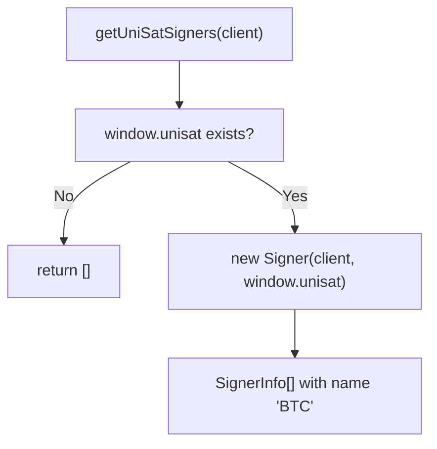
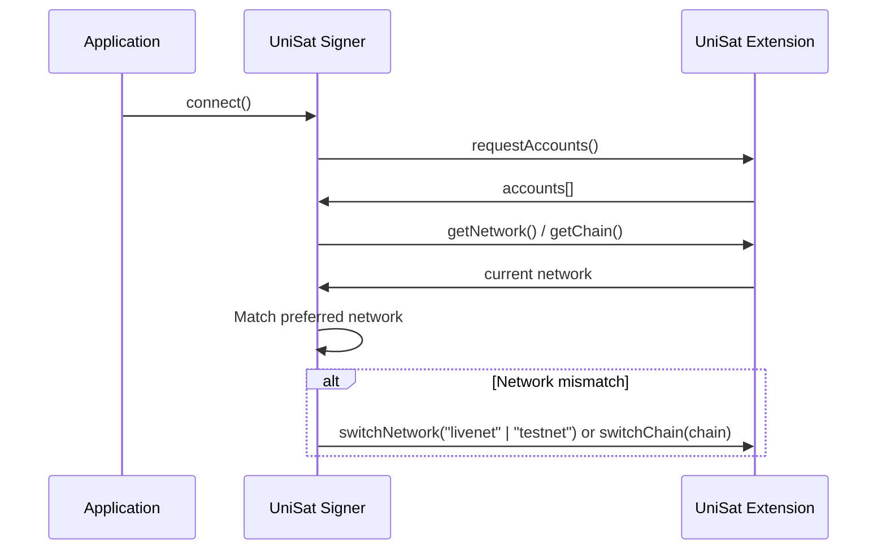
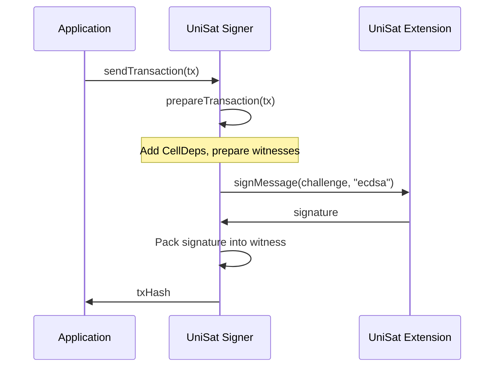

import { PackageBadges } from '@/components/package-badges';

`@ckb-ccc/uni-sat` integrates [UniSat Wallet](https://unisat.io/) into CCC, providing a `SignerBtc` implementation for Bitcoin signing. It communicates with the wallet via the browser-injected `window.unisat` object and supports automatic network switching between Bitcoin mainnet and testnet.

<Callout type="info">
  If you're using `@ckb-ccc/connector-react` or `@ckb-ccc/ccc`, UniSat is already included — no separate installation needed.
</Callout>

## Installation

<PackageBadges pkg="@ckb-ccc/uni-sat" />

<Tabs items={['npm', 'yarn', 'pnpm']}>
  <Tab value="npm">
    ```bash theme={null}
    npm install @ckb-ccc/uni-sat
    ```
  </Tab>
  <Tab value="yarn">
    ```bash theme={null}
    yarn add @ckb-ccc/uni-sat
    ```
  </Tab>
  <Tab value="pnpm">
    ```bash theme={null}
    pnpm add @ckb-ccc/uni-sat
    ```
  </Tab>
</Tabs>

**Dependencies:**

| Package | Description |
| ------- | ----------- |
| `@ckb-ccc/core` | Base types — `Signer`, `Client`, `Transaction`, and more |

## Architecture



### Entry point: `getUniSatSigners`

`getUniSatSigners(client, preferredNetworks?)` checks for `window.unisat` and returns a `SignerInfo[]` array — empty if the wallet isn't available:



## The `Signer` class

`Signer` extends `ccc.SignerBtc` and adapts the UniSat provider interface to CKB signing.

### Key methods

| Method | Description |
| ------ | ----------- |
| `connect()` | Calls `requestAccounts()` then ensures the correct BTC network |
| `isConnected()` | Returns `true` if accounts exist and network matches |
| `getBtcAccount()` | Returns the first BTC address from the provider |
| `getBtcPublicKey()` | Returns the BTC public key (hex-encoded) |
| `signMessageRaw(message)` | Signs via `signMessage(msg, "ecdsa")` |
| `onReplaced(listener)` | Fires on `accountsChanged` or `networkChanged` events |

### Network management

UniSat supports multiple Bitcoin networks. On `connect()`, the signer automatically switches the wallet to the correct network based on `preferredNetworks` configuration:

| CKB Network | Default BTC Network |
| ----------- | ------------------- |
| Mainnet (`ckb`) | `btc` (livenet) |
| Testnet (`ckt`) | `btcTestnet` (testnet) |



The signer also supports Fractal Bitcoin via the `switchChain` API (when available).

### Signing flow



## Account change detection

`Signer` implements `onReplaced()` to handle account or network changes:

- Listens for `"accountsChanged"` — user switched BTC account
- Listens for `"networkChanged"` — user switched BTC network

When either fires, the application callback is invoked and the listener is cleaned up.

## Provider interface

| Method | Description |
| ------ | ----------- |
| `requestAccounts()` | Prompt user to connect and return accounts |
| `getAccounts()` | Get connected accounts (no prompt) |
| `getPublicKey()` | Get the BTC public key |
| `getNetwork()` | Get current network (`"livenet"` or `"testnet"`) |
| `switchNetwork(network)` | Switch between livenet/testnet |
| `getChain()` | Get current chain (extended API) |
| `switchChain(chain)` | Switch chain (extended API, supports Fractal) |
| `signMessage(msg, type)` | Sign a message with `"ecdsa"` or `"bip322-simple"` |

## Integration pattern

`@ckb-ccc/uni-sat` follows the same integration contract as every other wallet package in CCC:

- **Factory function** — `getUniSatSigners` returns a `SignerInfo[]` array.
- **Provider detection** — checks for `window.unisat` before creating signers.
- **Graceful degradation** — returns an empty array when the wallet is unavailable.

This package is also used as a dependency by `@ckb-ccc/okx` for its Bitcoin signing support.