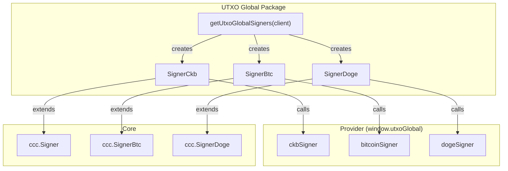
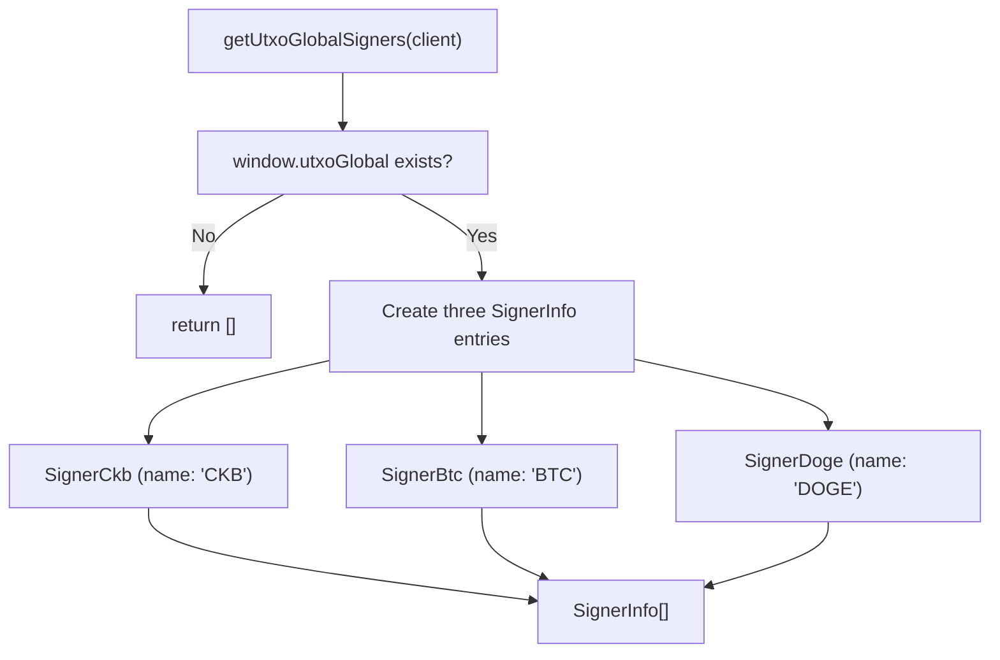

`@ckb-ccc/utxo-global` integrates [UTXO Global](https://utxo.global/) into CCC, providing `Signer` implementations for CKB, Bitcoin, and Dogecoin. UTXO Global is a multi-chain browser extension wallet that supports native CKB transaction signing as well as cross-chain signing from BTC and DOGE.

<Callout type="info">
  If you're using `@ckb-ccc/connector-react` or `@ckb-ccc/ccc`, UTXO Global is already included — no separate installation needed.
</Callout>

## Installation

<Tabs items={['npm', 'yarn', 'pnpm']}>
  <Tab value="npm">
```bash theme={null}
    npm install @ckb-ccc/utxo-global
```
  </Tab>
  <Tab value="yarn">
```bash theme={null}
    yarn add @ckb-ccc/utxo-global
```
  </Tab>
  <Tab value="pnpm">
```bash theme={null}
    pnpm add @ckb-ccc/utxo-global
```
  </Tab>
</Tabs>

**Dependencies:**

| Package | Description |
| ------- | ----------- |
| `@ckb-ccc/core` | Base types — `Signer`, `Client`, `Transaction`, and more |

## Architecture

`@ckb-ccc/utxo-global` provides three separate signers from a single provider injection at `window.utxoGlobal`:



### Entry point: `getUtxoGlobalSigners`

`getUtxoGlobalSigners(client, preferredNetworks?)` checks for `window.utxoGlobal` and returns a `SignerInfo[]` array with all three signers — or an empty array if the wallet isn't available:



## Supported signer types

| Signer Class | Base Type | Chain | SignerType |
| ------------ | --------- | ----- | --------- |
| `SignerCkb` | `ccc.Signer` | CKB | `CKB` |
| `SignerBtc` | `ccc.SignerBtc` | Bitcoin | `BTC` |
| `SignerDoge` | `ccc.SignerDoge` | Dogecoin | `BTC` |

### CKB signer

`SignerCkb` provides native CKB signing — no cross-chain address derivation needed. It calls `signTransaction()` on the provider directly.

### BTC and DOGE signers

`SignerBtc` and `SignerDoge` extend their respective cross-chain base classes. They derive CKB addresses from Bitcoin/Dogecoin public keys and sign CKB transaction witnesses using the respective chain's signing scheme.

## Account change detection

All three signers implement `onReplaced()`:

- Listens for `"accountsChanged"` — user switched account
- Listens for `"networkChanged"` — user switched network

When either fires, the application callback is invoked and listeners are cleaned up.

## Provider interface

All three sub-providers (`ckbSigner`, `bitcoinSigner`, `dogeSigner`) share the same interface:

| Method | Description |
| ------ | ----------- |
| `requestAccounts()` | Prompt user to connect and return accounts |
| `getAccount()` | Get connected accounts |
| `getPublicKey()` | Get address and public key pairs |
| `connect()` | Establish connection |
| `isConnected()` | Check connection status |
| `signMessage(msg, address)` | Sign a message |
| `signTransaction(tx)` | Sign a full CKB transaction (CKB signer only) |
| `getNetwork()` | Get current network |
| `switchNetwork(network)` | Switch network |

## Integration pattern

`@ckb-ccc/utxo-global` follows the same integration contract as every other wallet package in CCC:

- **Factory function** — `getUtxoGlobalSigners` returns a `SignerInfo[]` array.
- **Provider detection** — checks for `window.utxoGlobal` before creating signers.
- **Graceful degradation** — returns an empty array when the wallet is unavailable.

## References

- [UTXO Global Website](https://utxo.global/)