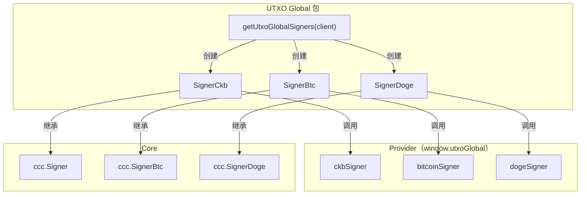
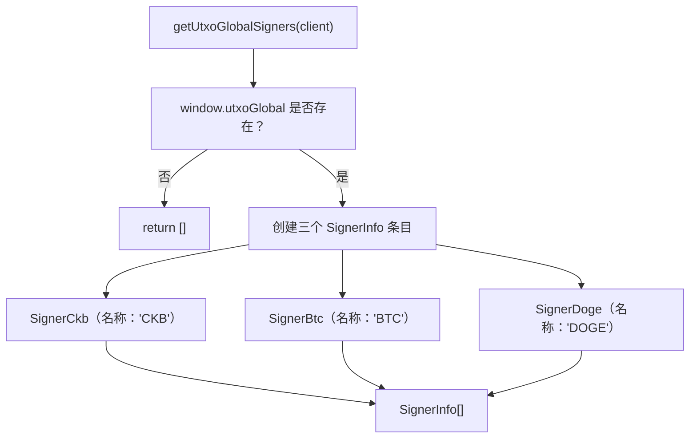

import { PackageBadges } from '@/components/package-badges';

`@ckb-ccc/utxo-global` 将 [UTXO Global](https://utxo.global/) 集成至 CCC，为 CKB、Bitcoin 和 Dogecoin 提供 `Signer` 实现。UTXO Global 是一款多链浏览器扩展钱包，支持原生 CKB 交易签名，以及通过 BTC 和 DOGE 进行跨链签名。

<Callout type="info">
  如果你使用的是 `@ckb-ccc/connector-react` 或 `@ckb-ccc/ccc`，UTXO Global 已内置其中，无需单独安装。
</Callout>

## 安装

<PackageBadges pkg="@ckb-ccc/utxo-global" />

<Tabs items={['npm', 'yarn', 'pnpm']}>
  <Tab value="npm">
    ```bash
    npm install @ckb-ccc/utxo-global
    ```
  </Tab>
  <Tab value="yarn">
    ```bash
    yarn add @ckb-ccc/utxo-global
    ```
  </Tab>
  <Tab value="pnpm">
    ```bash
    pnpm add @ckb-ccc/utxo-global
    ```
  </Tab>
</Tabs>

**依赖：**

| 包 | 说明 |
| --------------- | ----------- |
| `@ckb-ccc/core` | 基础类型——`Signer`、`Client`、`Transaction` 等 |

## 架构

`@ckb-ccc/utxo-global` 从 `window.utxoGlobal` 注入的单一 Provider 中提供三个独立的 Signer：



### 入口：`getUtxoGlobalSigners`

`getUtxoGlobalSigners(client, preferredNetworks?)` 检查 `window.utxoGlobal` 是否存在，并返回包含三个 Signer 的 `SignerInfo[]` 数组——钱包不可用时返回空数组：



## 支持的 Signer 类型

| Signer 类 | 基类 | 链 | SignerType |
| ------------ | --------- | ----- | --------- |
| `SignerCkb` | `ccc.Signer` | CKB | `CKB` |
| `SignerBtc` | `ccc.SignerBtc` | Bitcoin | `BTC` |
| `SignerDoge` | `ccc.SignerDoge` | Dogecoin | `Doge` |

### CKB Signer

`SignerCkb` 提供原生 CKB 签名能力，无需跨链地址派生，直接调用 Provider 的 `signTransaction()`。

### BTC 与 Doge Signer

`SignerBtc` 和 `SignerDoge` 分别继承对应的跨链基类，从 Bitcoin / Dogecoin 公钥派生 CKB 地址，并使用各自链的签名方案对 CKB 交易 Witness 进行签名。

## 账户变更检测

三个 Signer 均实现了 `onReplaced()`：

- 监听 `"accountsChanged"`——用户切换了账户
- 监听 `"networkChanged"`——用户切换了网络

任一事件触发时，应用回调会被调用，监听器随即自动清理。

## Provider 接口

三个子 Provider（`ckbSigner`、`bitcoinSigner`、`dogeSigner`）共享同一接口：

| 方法 | 说明 |
| ------ | ----------- |
| `requestAccounts()` | 提示用户连接并返回账户列表 |
| `getAccount()` | 获取已连接账户 |
| `getPublicKey()` | 获取地址与公钥对 |
| `connect()` | 建立连接 |
| `isConnected()` | 检查连接状态 |
| `signMessage(msg, address)` | 签名消息 |
| `signTransaction(tx)` | 对完整 CKB 交易进行签名（仅 CKB Signer） |
| `getNetwork()` | 获取当前网络 |
| `switchNetwork(network)` | 切换网络 |

## 集成模式

`@ckb-ccc/utxo-global` 遵循 CCC 中所有钱包包相同的集成约定：

- **Factory 函数**——`getUtxoGlobalSigners` 返回 `SignerInfo[]` 数组。
- **Provider 检测**——创建 Signer 前先检查 `window.utxoGlobal` 是否存在。
- **优雅降级**——钱包不可用时返回空数组。

## 参考资料

- [UTXO Global 官网](https://utxo.global/)