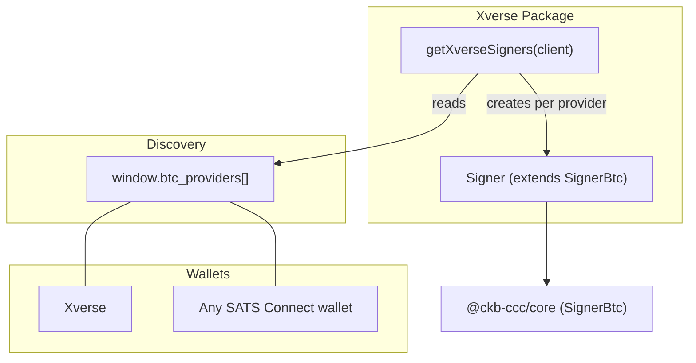
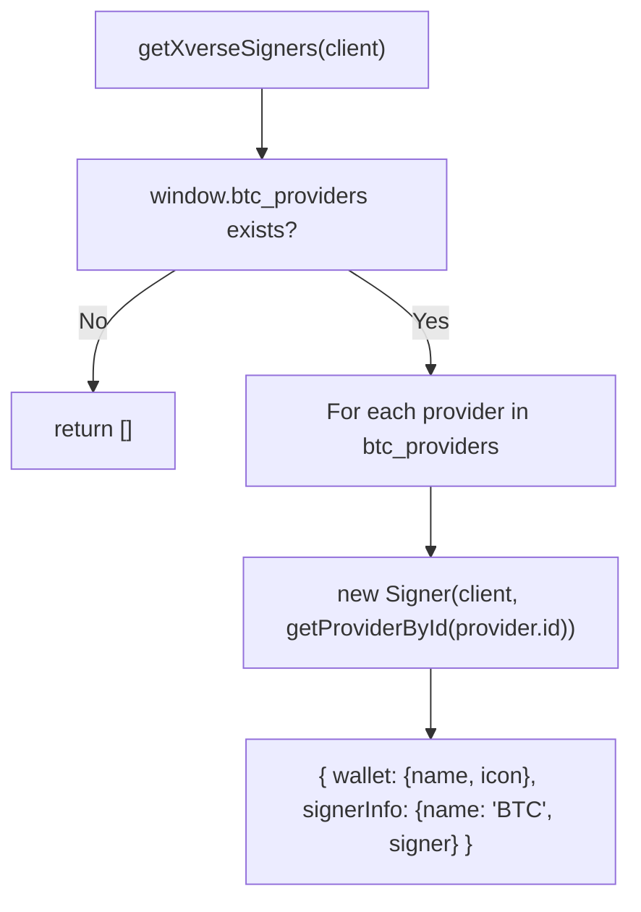
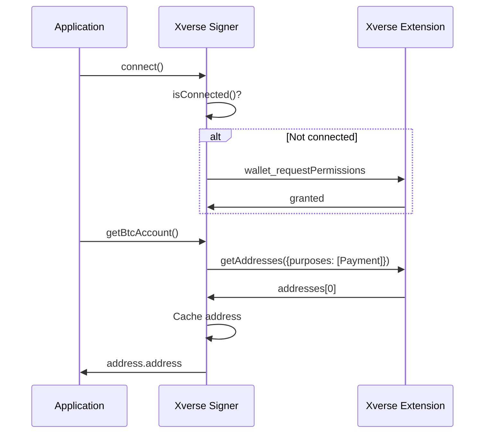
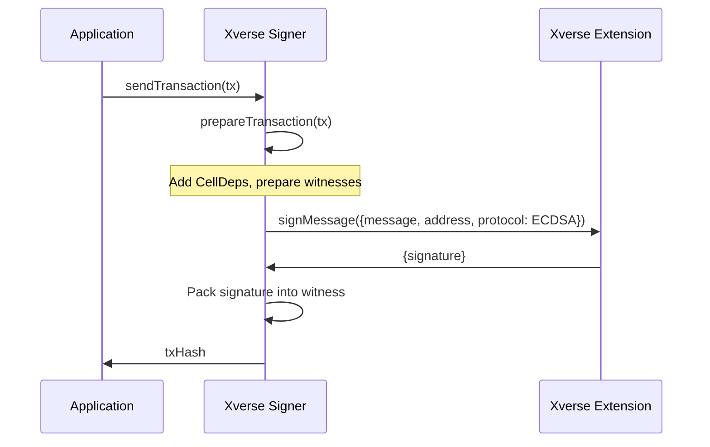

`@ckb-ccc/xverse` integrates [Xverse Wallet](https://www.xverse.app/) and any [SATS Connect](https://docs.xverse.app/sats-connect) compatible Bitcoin wallet into CCC. It provides a `SignerBtc` implementation using the SATS Connect RPC protocol, supporting multi-wallet discovery via `window.btc_providers`.

<Callout type="info">
  If you're using `@ckb-ccc/connector-react` or `@ckb-ccc/ccc`, Xverse is already included — no separate installation needed.
</Callout>

## Installation

<Tabs items={['npm', 'yarn', 'pnpm']}>
  <Tab value="npm">
```bash theme={null}
    npm install @ckb-ccc/xverse
```
  </Tab>
  <Tab value="yarn">
```bash theme={null}
    yarn add @ckb-ccc/xverse
```
  </Tab>
  <Tab value="pnpm">
```bash theme={null}
    pnpm add @ckb-ccc/xverse
```
  </Tab>
</Tabs>

**Dependencies:**

| Package | Description |
| ------- | ----------- |
| `@ckb-ccc/core` | Base types — `Signer`, `Client`, `Transaction`, and more |

## Architecture

Unlike other wallet packages that detect a single global provider, `@ckb-ccc/xverse` uses the `window.btc_providers` array to discover multiple SATS Connect wallets simultaneously.



### Entry point: `getXverseSigners`

`getXverseSigners(client, preferredNetworks?)` reads from `window.btc_providers` and returns a `{ wallet, signerInfo }[]` array — one entry per discovered wallet:



Each provider entry includes wallet metadata (`name`, `icon`) allowing `SignersController` to display distinct wallet entries.

## The `Signer` class

`Signer` extends `ccc.SignerBtc` and uses the SATS Connect RPC protocol for all wallet interactions.

### Key methods

| Method | Description |
| ------ | ----------- |
| `connect()` | Calls `wallet_requestPermissions` if not already connected |
| `disconnect()` | Clears the cached address |
| `isConnected()` | Attempts `getBalance` — returns `true` on success |
| `getBtcAccount()` | Returns the payment address via `getAddresses` |
| `getBtcPublicKey()` | Returns the public key from the payment address |
| `signMessageRaw(message)` | Signs via `signMessage` with ECDSA protocol |
| `onReplaced(listener)` | Fires on `accountChange` or `networkChange` events |

### Connection and address caching

The signer caches the resolved address to avoid redundant RPC calls. The cache is invalidated on `disconnect()`:



### Network preferences

| CKB Network | Default BTC Network |
| ----------- | ------------------- |
| Mainnet (`ckb`) | `btc` |
| Testnet (`ckt`) | `btcTestnet` |

### Signing flow



## Account change detection

`Signer` implements `onReplaced()` via the SATS Connect event API:

- Listens for `"accountChange"` — user switched BTC account
- Listens for `"networkChange"` — user switched BTC network

Returns cleanup functions from `provider.addListener()` for proper teardown.

## SATS Connect RPC methods

| Method | Description |
| ------ | ----------- |
| `wallet_requestPermissions` | Request wallet connection permissions |
| `getAddresses` | Get addresses filtered by purpose (Payment, Ordinals, etc.) |
| `getBalance` | Get wallet balance (used for connection check) |
| `signMessage` | Sign a message with ECDSA or BIP-322 |

## Integration pattern

`@ckb-ccc/xverse` follows the same integration contract as other wallet packages in CCC:

- **Factory function** — `getXverseSigners` returns `{ wallet, signerInfo }[]` for multi-wallet support.
- **Provider detection** — reads `window.btc_providers` array.
- **Multi-wallet discovery** — creates separate signer entries per provider with distinct wallet names and icons.
- **Graceful degradation** — returns an empty array when no SATS Connect wallets are available.
