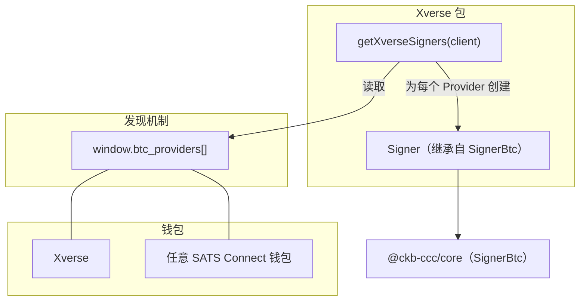
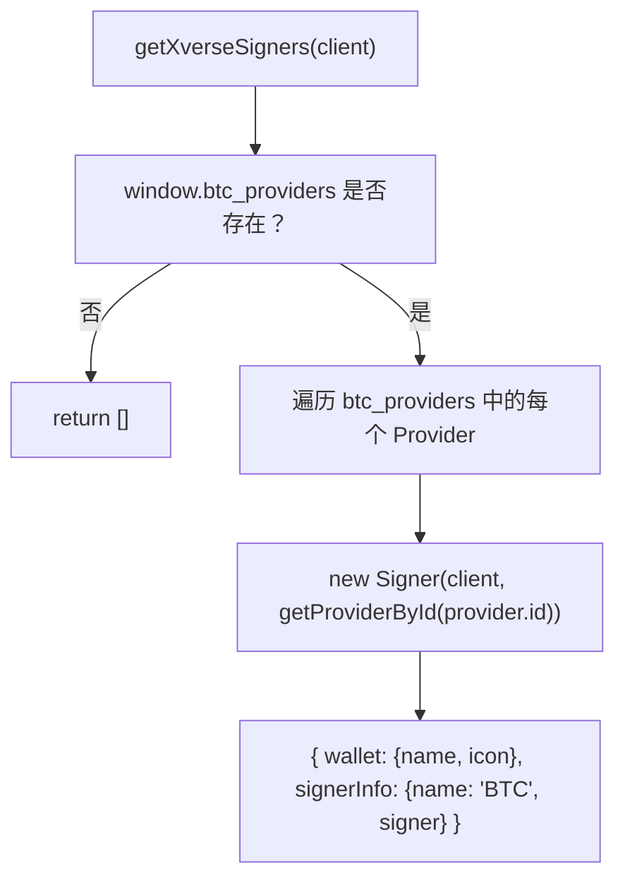
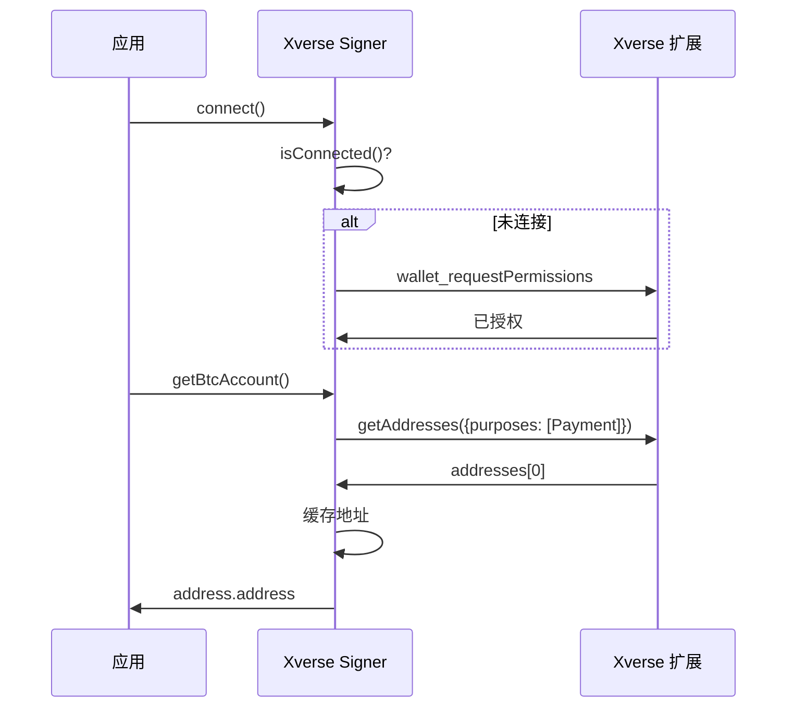
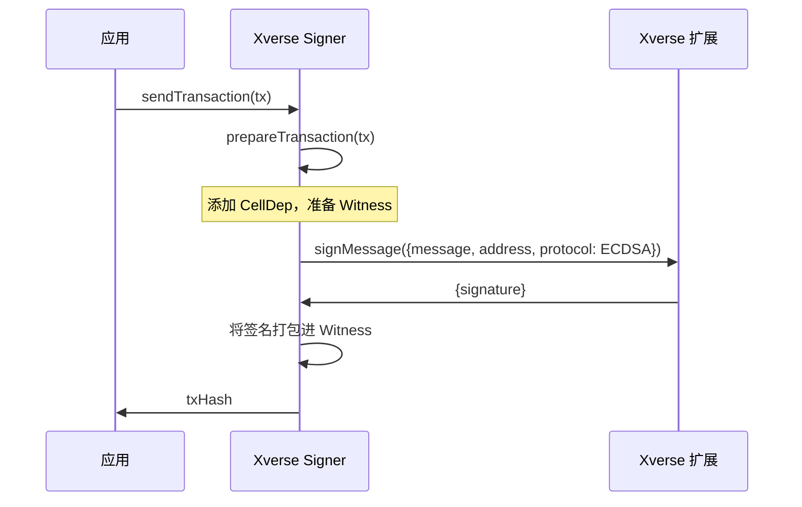

import { PackageBadges } from '@/components/package-badges';

`@ckb-ccc/xverse` 将 [Xverse Wallet](https://www.xverse.app/) 及任意兼容 [SATS Connect](https://docs.xverse.app/sats-connect) 的 Bitcoin 钱包集成至 CCC。它基于 SATS Connect RPC 协议提供 `SignerBtc` 实现，并通过 `window.btc_providers` 支持多钱包发现。

<Callout type="info">
  如果你使用的是 `@ckb-ccc/connector-react` 或 `@ckb-ccc/ccc`，Xverse 已内置其中，无需单独安装。
</Callout>

## 安装

<PackageBadges pkg="@ckb-ccc/xverse" />

<Tabs items={['npm', 'yarn', 'pnpm']}>
  <Tab value="npm">
    ```bash
    npm install @ckb-ccc/xverse
    ```
  </Tab>
  <Tab value="yarn">
    ```bash
    yarn add @ckb-ccc/xverse
    ```
  </Tab>
  <Tab value="pnpm">
    ```bash
    pnpm add @ckb-ccc/xverse
    ```
  </Tab>
</Tabs>

**依赖：**

| 包 | 说明 |
| --------------- | ----------- |
| `@ckb-ccc/core` | 基础类型——`Signer`、`Client`、`Transaction` 等 |

## 架构

与其他只检测单一全局 Provider 的钱包包不同，`@ckb-ccc/xverse` 通过读取 `window.btc_providers` 数组同时发现多个兼容 SATS Connect 的钱包。



### 入口：`getXverseSigners`

`getXverseSigners(client, preferredNetworks?)` 从 `window.btc_providers` 读取数据，为每个发现的钱包返回一个 `{ wallet, signerInfo }[]` 数组条目：



每个 Provider 条目包含钱包元数据（`name`、`icon`），`SignersController` 据此为每个钱包显示独立条目。

## `Signer` 类

`Signer` 继承自 `ccc.SignerBtc`，所有钱包交互均通过 SATS Connect RPC 协议完成。

### 核心方法

| 方法 | 说明 |
| ------------------------- | ----------- |
| `connect()` | 若尚未连接，调用 `wallet_requestPermissions` |
| `disconnect()` | 清除缓存的地址 |
| `isConnected()` | 尝试调用 `getBalance`，成功则返回 `true` |
| `getBtcAccount()` | 通过 `getAddresses` 返回支付地址 |
| `getBtcPublicKey()` | 从支付地址中返回公钥 |
| `signMessageRaw(message)` | 通过 `signMessage` 使用 ECDSA 协议签名 |
| `onReplaced(listener)` | 在 `accountChange` 或 `networkChange` 事件触发时调用 |

### 连接与地址缓存

Signer 缓存已解析的地址以避免重复 RPC 调用，调用 `disconnect()` 时缓存失效：



### 网络偏好

| CKB 网络 | 默认 BTC 网络 |
| --------------- | ------------------- |
| 主网（`ckb`） | `btc` |
| 测试网（`ckt`） | `btcTestnet` |

### 签名流程



## 账户变更检测

`Signer` 通过 SATS Connect 事件 API 实现 `onReplaced()`：

- 监听 `"accountChange"`——用户切换了 BTC 账户
- 监听 `"networkChange"`——用户切换了 BTC 网络

通过 `provider.addListener()` 返回清理函数，确保监听器正确移除。

## SATS Connect RPC 方法

| 方法 | 说明 |
| --------------------------- | ----------- |
| `wallet_requestPermissions` | 请求钱包连接权限 |
| `getAddresses` | 按用途（Payment、Ordinals 等）获取地址列表 |
| `getBalance` | 获取钱包余额（用于连接状态检查） |
| `signMessage` | 使用 ECDSA 或 BIP-322 签名消息 |

## 集成模式

`@ckb-ccc/xverse` 遵循 CCC 中其他钱包包相同的集成约定：

- **Factory 函数**——`getXverseSigners` 返回支持多钱包的 `{ wallet, signerInfo }[]` 数组。
- **Provider 检测**——读取 `window.btc_providers` 数组。
- **多钱包发现**——为每个 Provider 创建独立的 Signer 条目，附带各自的钱包名称和图标。
- **优雅降级**——无可用的 SATS Connect 钱包时返回空数组。