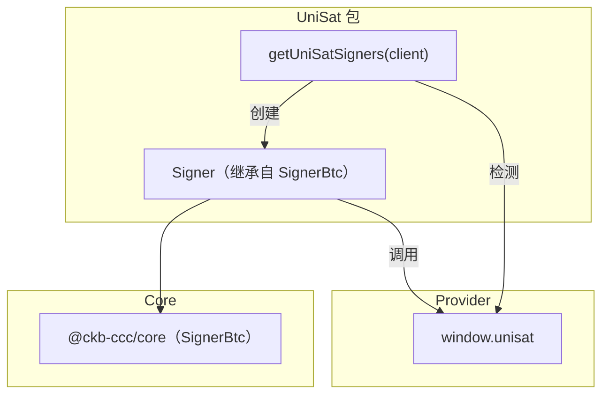
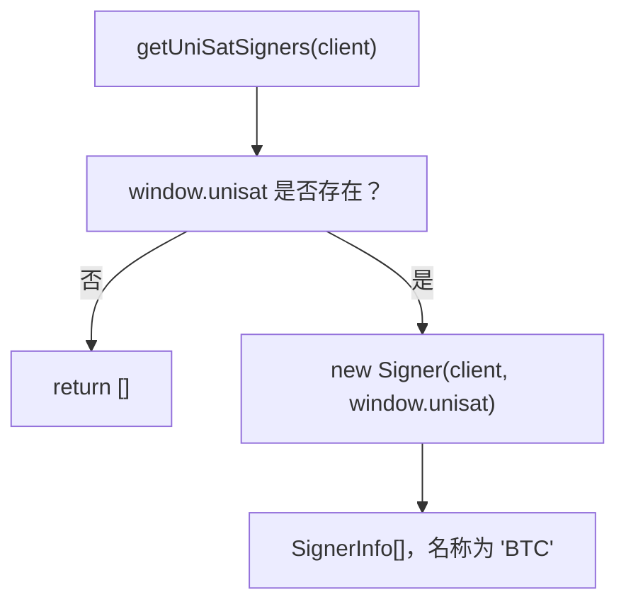
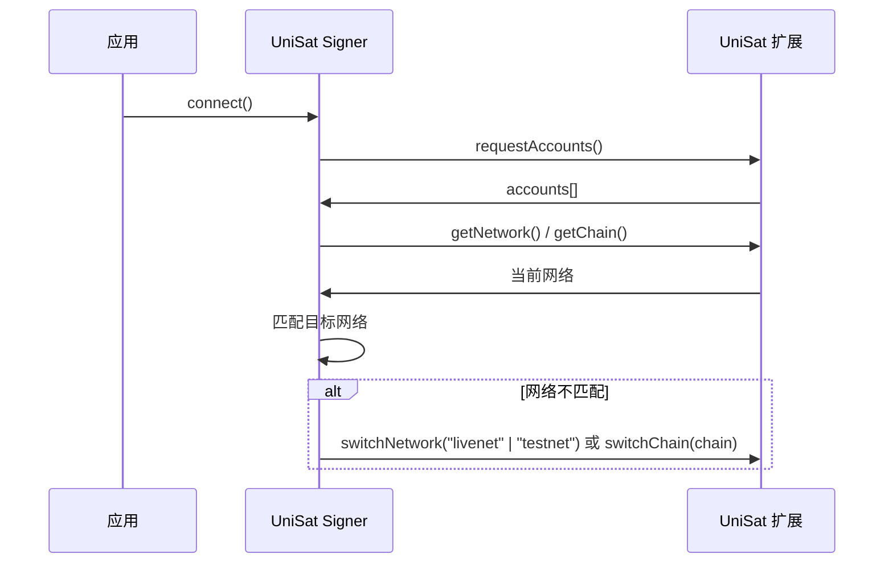
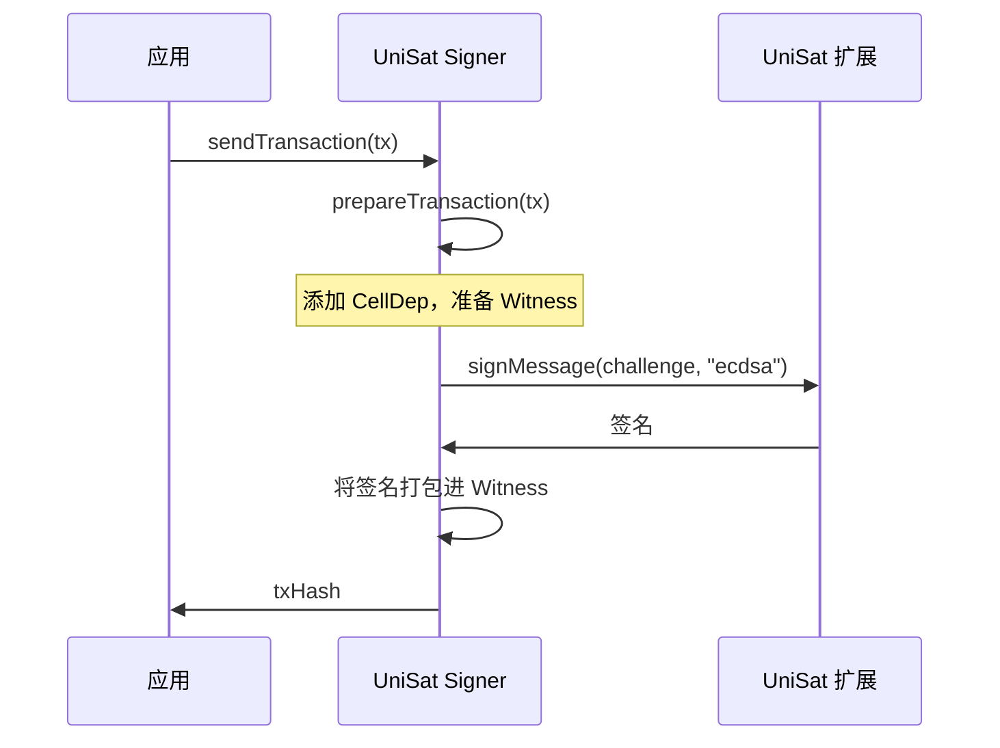

import { PackageBadges } from '@/components/package-badges';

`@ckb-ccc/uni-sat` 将 [UniSat Wallet](https://unisat.io/) 集成至 CCC，提供用于 Bitcoin 签名的 `SignerBtc` 实现。它通过浏览器注入的 `window.unisat` 对象与钱包通信，并支持在 Bitcoin 主网和测试网之间进行网络切换。

<Callout type="info">
  如果你使用的是 `@ckb-ccc/connector-react` 或 `@ckb-ccc/ccc`，UniSat 已内置其中，无需单独安装。
</Callout>

## 安装

<PackageBadges pkg="@ckb-ccc/uni-sat" />

<Tabs items={['npm', 'yarn', 'pnpm']}>
  <Tab value="npm">
    ```bash
    npm install @ckb-ccc/uni-sat
    ```
  </Tab>
  <Tab value="yarn">
    ```bash
    yarn add @ckb-ccc/uni-sat
    ```
  </Tab>
  <Tab value="pnpm">
    ```bash
    pnpm add @ckb-ccc/uni-sat
    ```
  </Tab>
</Tabs>

**依赖：**

| 包 | 说明 |
| ------- | ----------- |
| `@ckb-ccc/core` | 基础类型——`Signer`、`Client`、`Transaction` 等 |

## 架构



### 入口：`getUniSatSigners`

`getUniSatSigners(client, preferredNetworks?)` 检查 `window.unisat` 是否存在，并返回 `SignerInfo[]` 数组——钱包不可用时返回空数组：



## `Signer` 类

`Signer` 继承自 `ccc.SignerBtc`，将 UniSat Provider 接口适配为 CKB 签名接口。

### 核心方法

| 方法 | 说明 |
| ------ | ----------- |
| `connect()` | 调用 `requestAccounts()`，并确保切换到正确的 BTC 网络 |
| `isConnected()` | 账户存在且网络匹配时返回 `true` |
| `getBtcAccount()` | 返回 Provider 中的第一个 BTC 地址 |
| `getBtcPublicKey()` | 返回 BTC 公钥（十六进制编码） |
| `signMessageRaw(message)` | 通过 `signMessage(msg, "ecdsa")` 签名 |
| `onReplaced(listener)` | 在 `accountsChanged` 或 `networkChanged` 事件触发时调用 |

### 网络管理

UniSat 支持多个 Bitcoin 网络。调用 `connect()` 时，Signer 根据 `preferredNetworks` 配置自动将钱包切换到正确的网络：

| CKB 网络 | 默认 BTC 网络 |
| ----------- | ------------------- |
| 主网（`ckb`） | `btc`（livenet） |
| 测试网（`ckt`） | `btcTestnet`（testnet） |



通过 `switchChain` API（若可用），Signer 还支持 Fractal Bitcoin。

### 签名流程



## 账户变更检测

`Signer` 通过 `onReplaced()` 处理账户或网络变更：

- 监听 `"accountsChanged"`——用户在钱包中切换了 BTC 账户
- 监听 `"networkChanged"`——用户切换了 BTC 网络

任一事件触发时，应用回调会被调用，监听器随即自动清理。

## Provider 接口

| 方法 | 说明 |
| ------ | ----------- |
| `requestAccounts()` | 提示用户连接并返回账户列表 |
| `getAccounts()` | 获取已连接账户（不触发提示） |
| `getPublicKey()` | 获取 BTC 公钥 |
| `getNetwork()` | 获取当前网络（`"livenet"` 或 `"testnet"`） |
| `switchNetwork(network)` | 在 livenet / testnet 之间切换 |
| `getChain()` | 获取当前链（扩展 API） |
| `switchChain(chain)` | 切换链（扩展 API，支持 Fractal） |
| `signMessage(msg, type)` | 使用 `"ecdsa"` 或 `"bip322-simple"` 签名消息 |

## 集成模式

`@ckb-ccc/uni-sat` 遵循 CCC 中所有钱包包相同的集成约定：

- **Factory 函数**——`getUniSatSigners` 返回 `SignerInfo[]` 数组。
- **Provider 检测**——创建 Signer 前先检查 `window.unisat` 是否存在。
- **优雅降级**——钱包不可用时返回空数组。

`@ckb-ccc/okx` 也将本包作为依赖，用于其 Bitcoin 签名支持。